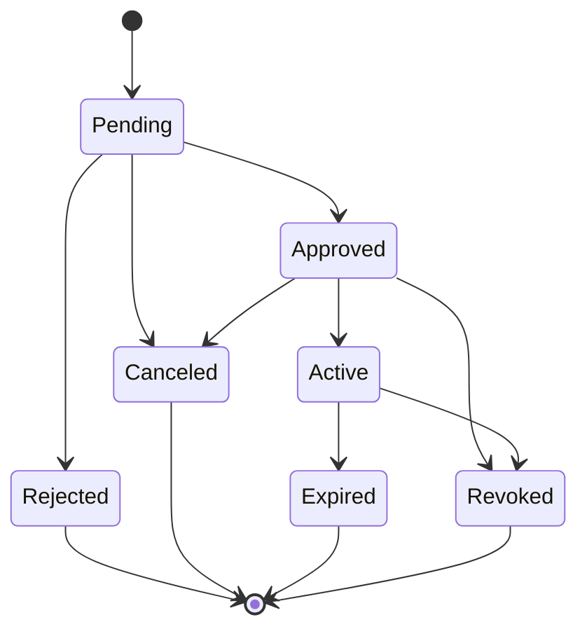

# OpsForge AccessRequest Domain Specification

**Status:** Pending Review

**Scope:** AccessRequest domain only

**Applies to:** Future implementation in `app/access/` and access-request references in the wider domain

**Out of scope:** SQLAlchemy models, Python code, migrations, repositories, services, APIs, the Approval entity/logic, authorization logic, and business service implementations

---

## 1. Executive Summary

The AccessRequest domain represents the transactional workflow entity within the OpsForge Privileged Access Management (PAM) platform. An AccessRequest is the core operational object that captures a User's intent to gain privileged access to a specific Resource. It is the central nervous system of just-in-time (JIT) access.

Following the OpsForge Architecture-First methodology, this domain isolates the request lifecycle from the approval decision-making process. The AccessRequest domain tracks the 'who, what, why, and how long', along with the current operational state of the request. It relies on a strictly separate Approval domain to capture decisions, ensuring that complex workflows, multi-stage approvals, and policy evaluations can evolve without changing the core AccessRequest contract.

---

## 2. Business Analysis

In a mature PAM system, standing privileges are a primary security vulnerability. The system must enforce least privilege by requiring operators to request access only when needed (JIT). 

OpsForge needs to track these requests predictably. A single request must traverse a state machine—from pending to approved, and eventually to an expired or revoked state. It must survive structural organizational changes; for example, if an operator's manager changes while a request is pending, the original routing context must be preserved to prevent workflow deadlocks or audit inconsistencies.

---

## 3. Domain Purpose

The AccessRequest domain exists to securely store and govern the lifecycle of a request for access. It acts as the immutable record of intent and the state machine governing the active access window. It provides the necessary context to evaluators (managers, owners, security teams, policy engines) to make informed decisions without tightly coupling those decisions to the request structure itself.

---

## 4. Responsibilities

- Owning the request lifecycle and state machine (e.g., pending, approved, active, expired).
- Storing the relationships between the requester (User) and the target (Resource).
- Capturing a stable point-in-time snapshot of the requester's reporting chain (`manager_snapshot_user_id`) to ensure consistent approval routing.
- Maintaining the temporal bounds of the access (requested duration and absolute expiration).
- Preserving the business justification for the request.
- Acting as the anchor for the Approval domain and Audit Logs.

---

## 5. Out-of-Scope Responsibilities

- **Approval Logic:** The AccessRequest does not decide if it is approved. The separate Approval domain handles decision records.
- **Access Brokering:** The AccessRequest does not physically open network ports, inject credentials, or issue tokens. It simply dictates that access *should* be allowed.
- **Resource Lifecycle:** The AccessRequest does not manage the target Resource's state.
- **Authorization/Policy Engine:** The AccessRequest does not store complex rules for evaluating requests.

---

## 6. DDD Boundary Statement

AccessRequest is a core domain entity in the `access` bounded context. It strictly owns the request state, the temporal access boundaries, the business justification, and the immutable contextual snapshot of the requester's environment at the time of creation. It delegates all decision-making to the `Approval` boundary and execution to external broker systems.

---

## 7. AccessRequest Lifecycle

The lifecycle defines the operational states a request can hold.

### 7.1 Valid States
- **Pending:** The request is awaiting a decision.
- **Approved:** The request is authorized but the access window has not yet begun (or is awaiting provisioning).
- **Active:** The access window is currently open, and the user is permitted to connect.
- **Rejected:** The request was denied by an approver or policy. (Terminal)
- **Canceled:** The requester withdrew the request before it was fulfilled. (Terminal)
- **Expired:** The approved access window elapsed naturally. (Terminal)
- **Revoked:** An administrator or owner prematurely terminated active or approved access. (Terminal)

### 7.2 State Transition Model

### 7.3 Invalid Transitions
- A terminal state (`Rejected`, `Canceled`, `Expired`, `Revoked`) can **never** transition back to an active or pending state. A new AccessRequest must be created.
- `Pending` cannot jump directly to `Active` without passing through an `Approved` phase logically (even if automated, the state transition must occur for audit completeness).

---

## 8. Relationships

### 8.1 Relationship with User (Requester)
**Cardinality:** Many-to-One (Many requests belong to one requester)
- The `requester_user_id` links to the User domain.
- A requester cannot approve their own request. (Enforced in Approval domain, based on this identity).

### 8.2 Relationship with User (Manager Snapshot)
**Cardinality:** Many-to-One
- The `manager_snapshot_user_id` captures the requester's manager at the exact moment of creation. If the User's profile changes later, the request routing remains stable and auditable.

### 8.3 Relationship with Resource (Target)
**Cardinality:** Many-to-One (Many requests can target one Resource)
- The `resource_id` defines the requested target.
- If the Resource is retired while a request is Pending, the request should logically fail or be canceled.

### 8.4 Relationship with Approval Domain
**Cardinality:** One-to-Many (One AccessRequest has many Approval decision records)
- The Approval domain owns the decisions. The AccessRequest aggregates these decisions to transition its state from Pending to Approved.

### 8.5 Relationship with AuditLog
**Cardinality:** One-to-Many
- Every state transition and access event must generate AuditLog records referencing the `access_request_id`.

---

## 9. Attribute Definitions

| Attribute | Purpose | Type | Required | Mutable | Uniqueness | Default | Validation Rules |
|---|---|---|:---:|:---:|:---:|---|---|
| id | Primary business key | UUID v4 | Yes | No | Yes | Generated | Immutable |
| requester_user_id | Identifies the operator | UUID v4 | Yes | No | No | None | Must reference a valid User |
| resource_id | Identifies the target | UUID v4 | Yes | No | No | None | Must reference a valid non-retired Resource |
| manager_snapshot_user_id | Immutable routing context | UUID v4 | No | No | No | Derived at creation | Must capture User's current manager. Nullable if no manager. |
| status | Lifecycle state | Enum | Yes | Yes | No | `pending` | Must follow valid state machine transitions |
| justification | Business reason for access | String | Yes | No | No | None | Must be non-blank |
| requested_duration_minutes| Desired access window length | Integer | Yes | No | No | None | Must be > 0 and <= max policy duration |
| expires_at | Absolute expiration timestamp | Timestamp | No | Yes | No | Null | Set when Active. Cannot be extended. |
| created_at | Creation timestamp | Timestamp | Yes | No | No | Auto | Immutable UTC |
| updated_at | Modification timestamp | Timestamp | Yes | No | No | Auto | Updates on persisted change |

---

## 10. Business Rules

### 10.1 Immutability of Intent
Once an AccessRequest is created, its core intent (`resource_id`, `justification`, `requested_duration_minutes`, `requester_user_id`) cannot be changed. If a mistake is made, the request must be `canceled` and a new one created.

### 10.2 Snapshot Consistency
The `manager_snapshot_user_id` must be populated by querying the User domain at creation time. It must never update, guaranteeing that the original routing path is preserved for auditors.

### 10.3 Segregation of Duties
A requester cannot approve their own request. While the AccessRequest entity does not execute the approval, it provides the `requester_user_id` to the Approval domain, which must rigidly enforce this rule.

### 10.4 Historical Preservation
Historical requests (those in terminal states) must never be hard-deleted from the database. They are permanent compliance records.

### 10.5 Time-Bound Access
Access is strictly ephemeral. `expires_at` is calculated when the request transitions to `Active`. Once this time is reached, the state transitions to `Expired`.

---

## 11. Validation Strategy

### 11.1 Database Validation
- `id` is primary key.
- Foreign keys enforced for `requester_user_id`, `resource_id`, and `manager_snapshot_user_id`.
- Required fields have `NOT NULL` constraints.
- No cascading deletes.

### 11.2 Application Validation
- `justification` must meet minimum character length requirements.
- `requested_duration_minutes` must be positive.
- State transitions must strictly adhere to the defined lifecycle graph (e.g., blocking `Expired` -> `Active`).

### 11.3 Business Validation
- A request cannot be created against a `Retired` Resource.
- A request cannot be created by a `Disabled` User.

### 11.4 Authorization Validation
- Only the `requester_user_id` can `Cancel` the request.
- Only an administrator, resource owner, or manager can `Revoke` an active request.

---

## 12. Security Considerations

- **Least Privilege:** By keeping duration time-bound, the system prevents standing privileges.
- **Tamper Evidence:** The immutability of the manager snapshot and the strict state machine prevent operators from bypassing approval chains by changing their manager mid-flight.
- **Orphan Prevention:** Requests tied to a disabled requester or retired resource must be programmatically handled (e.g., swept to a Canceled or Revoked state).

---

## 13. Audit Expectations

The following state transitions must be logged to the AuditLog domain:
- Request created
- Request canceled (by requester)
- Request state changed to Approved (as an aggregate result of the Approval domain)
- Request state changed to Rejected
- Access window activated
- Request revoked (with the identity of the revoking actor)
- Request expired (system automated event)

---

## 14. Future Compatibility

This domain is designed to seamlessly integrate with future platform expansions:
- **Multi-Stage Approvals:** Because AccessRequest delegates decisions to the Approval domain, adding 5 layers of approval requires zero changes to the AccessRequest schema.
- **Policy Engines:** A future policy engine can evaluate the `requester_user_id` and `resource_id` to automatically transition a request to `Approved` without human intervention.
- **ITSM Integration:** A future `ticket_reference` or JSON metadata column can map an AccessRequest to a Jira or ServiceNow ticket without breaking the core domain.
- **Emergency Access (Break Glass):** Emergency access is simply an AccessRequest that transitions from `Pending` to `Active` via an automated policy, flagging an aggressive post-incident review.

---

## 15. Architecture Self-Review

### 15.1 Constraint Checks
- **Consistency:** Align terminology with User and Resource domains. (Pass)
- **No Implementation:** Kept strictly at the specification level without ORM syntax. (Pass)
- **Lifecycle Integrity:** Terminal states correctly defined, time-bounds established. (Pass)

### 15.2 Simplification Review
By stripping Approval logic out of the AccessRequest domain, the state machine is highly deterministic. The manager snapshot safely solves the complex organizational-drift problem without requiring complex historical queries.

### 15.3 Final Assessment
The AccessRequest domain adheres strictly to PAM best practices. It isolates the request intent from the approval decision, guarantees immutability of historical records, and provides a scalable, auditable foundation for just-in-time access workflows. 

**Recommendation:** PENDING ARCHITECTURE REVIEW -> READY FOR APPROVAL
