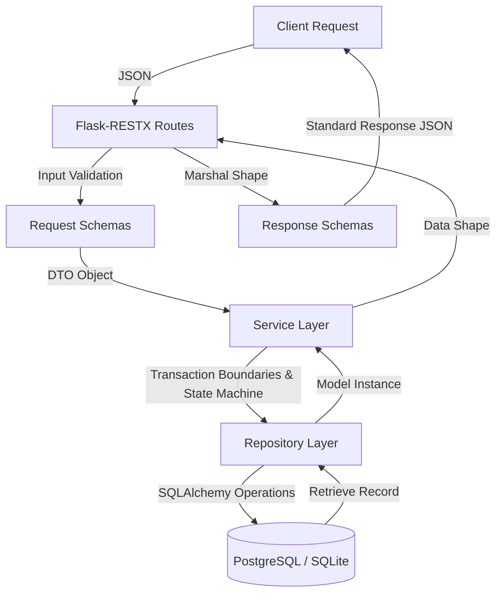

# API Design Specification - OpsForge Phase 1

This document specifies the Threat Intelligence Management API endpoints, serialization contracts, data validation models, and architectural routing flow.

---

## Architecture Flow

The application enforces a unidirectional boundary separation pattern to isolate transportation from business rules and persistence operations:



---

## Endpoint Specification

### 1. Threats Endpoint

#### `POST /threats` (Create Threat)
Creates a new Threat intelligence record.
- **Request Headers**: `Content-Type: application/json`
- **Request Payload Example**:
```json
{
  "indicator": "185.190.140.10",
  "indicator_type": "ip",
  "threat_level": "critical",
  "confidence": 98,
  "mitre_attack": "T1078",
  "source": "SOC Alert",
  "analyst_notes": "Suspicious login attempt",
  "assigned_analyst": "analyst_bob",
  "status": "Open",
  "tags": ["apt", "compromise"]
}
```
- **Response Payload Example (201 Created)**:
```json
{
  "success": true,
  "message": "Threat created successfully",
  "data": {
    "id": 1,
    "indicator": "185.190.140.10",
    "indicator_type": "ip",
    "threat_level": "critical",
    "confidence": 98,
    "mitre_attack": "T1078",
    "source": "SOC Alert",
    "analyst_notes": "Suspicious login attempt",
    "assigned_analyst": "analyst_bob",
    "last_updated_by": "analyst_bob",
    "status": "Open",
    "tags": ["apt", "compromise"],
    "first_seen": null,
    "last_seen": null,
    "created_at": "2026-06-30T09:30:15+00:00",
    "updated_at": "2026-06-30T09:30:15+00:00"
  }
}
```

#### `GET /threats` (List Threats)
Fetches threat records matching filters, supporting pagination and sorting.
- **Query Parameters**:
  - `page`: Page number (default: `1`)
  - `limit`: Items per page (default: `20`)
  - `sort`: Sorting field (default: `created_at`)
  - `order`: Sorting order (`asc` or `desc`, default: `desc`)
  - `status`: Filter by status
  - `indicator_type`: Filter by indicator type
- **Response Payload Example (200 OK)**:
```json
{
  "success": true,
  "message": "Threats retrieved successfully",
  "data": {
    "items": [
      {
        "id": 1,
        "indicator": "185.190.140.10",
        "indicator_type": "ip",
        "threat_level": "critical",
        "confidence": 98,
        "mitre_attack": "T1078",
        "source": "SOC Alert",
        "analyst_notes": "Suspicious login attempt",
        "assigned_analyst": "analyst_bob",
        "last_updated_by": "analyst_bob",
        "status": "Open",
        "tags": ["apt", "compromise"],
        "first_seen": null,
        "last_seen": null,
        "created_at": "2026-06-30T09:30:15+00:00",
        "updated_at": "2026-06-30T09:30:15+00:00"
      }
    ],
    "page": 1,
    "limit": 20,
    "total": 1,
    "pages": 1
  }
}
```

#### `GET /threats/<id>` (Read Threat)
Retrieves a specific Threat intelligence record.
- **Response Payload Example (200 OK)**:
```json
{
  "success": true,
  "message": "Threat retrieved successfully",
  "data": {
    "id": 1,
    "indicator": "185.190.140.10",
    "indicator_type": "ip",
    "threat_level": "critical",
    "confidence": 98,
    "mitre_attack": "T1078",
    "source": "SOC Alert",
    "analyst_notes": "Suspicious login attempt",
    "assigned_analyst": "analyst_bob",
    "last_updated_by": "analyst_bob",
    "status": "Open",
    "tags": ["apt", "compromise"],
    "first_seen": null,
    "last_seen": null,
    "created_at": "2026-06-30T09:30:15+00:00",
    "updated_at": "2026-06-30T09:30:15+00:00"
  }
}
```

#### `PUT /threats/<id>` (Update Threat)
Updates all fields of an existing threat indicator.
- **Request Payload Example**: Same as POST.
- **Response Payload Example (200 OK)**: Standard Threat JSON wrapper with `message: "Threat updated successfully"`.

#### `PATCH /threats/<id>/status` (Update Threat Status)
Updates only the status field, enforcing transitions via the Threat Status State Machine.
- **Request Payload**:
```json
{
  "status": "Investigating",
  "last_updated_by": "analyst_bob"
}
```
- **Response Payload Example (200 OK)**: Standard Threat JSON wrapper with updated status value.

#### `DELETE /threats/<id>` (Delete Threat)
Purges a threat intelligence record.
- **Response Payload Example (200 OK)**:
```json
{
  "success": true,
  "message": "Threat with ID 1 deleted successfully",
  "data": {}
}
```

---

### 2. Metrics telemetry Endpoint

#### `GET /threats/stats`
Yields a tally breakdown of threat metadata and indicators.
- **Response Payload Example (200 OK)**:
```json
{
  "success": true,
  "message": "Global metric tallies calculated successfully",
  "data": {
    "total": 64,
    "critical": 5,
    "high": 12,
    "open": 20,
    "closed": 44,
    "last_updated": "2026-06-30T09:50:54+00:00",
    "indicator_types": {
      "ip": 22,
      "domain": 14,
      "hash": 10,
      "url": 18
    }
  }
}
```

---

### 3. Vitality Endpoint

#### `GET /health`
Returns application live context statistics and database vitality check.
- **Response Payload Example (200 OK)**:
```json
{
  "success": true,
  "message": "System status check executed successfully",
  "data": {
    "application": "healthy",
    "database": "healthy",
    "version": "0.1.0",
    "uptime": 152.45,
    "environment": "development"
  }
}
```

---

## Validation & Enums

### Allowed Enums
- **Indicator Types (`indicator_type`)**: `ip`, `domain`, `hash`, `url`
- **Threat Levels (`threat_level`)**: `low`, `medium`, `high`, `critical`
- **Threat Statuses (`status`)**: `Open`, `Investigating`, `Contained`, `Closed`, `False Positive`

### Validation rules
- **Confidence Range**: Must be an integer between `0` and `100` inclusive.
- **State Transition Machine**:
  - `Open ──> Investigating ──> Contained ──> Closed`
  - `Open ──> False Positive ──> Closed`
  - Re-opening closed records (`Closed` -> `Open`) throws a 400 Validation Error.

---

## Error Handling Specifications

When errors occur, a standard JSON failure envelope is returned:

```json
{
  "success": false,
  "message": "Validation or structural failure description",
  "errors": [
    "Detailed error trace 1",
    "Detailed error trace 2"
  ]
}
```

### HTTP Status Codes
- **400 Bad Request**: Raised when payload validation fails (e.g. out of bound confidence, illegal status change).
- **404 Not Found**: Raised when requesting a resource ID that does not exist.
- **405 Method Not Allowed**: Raised when requesting a route with an unsupported HTTP method.
- **500 Internal Server Error**: Raised when database errors or unexpected system exceptions occur.
