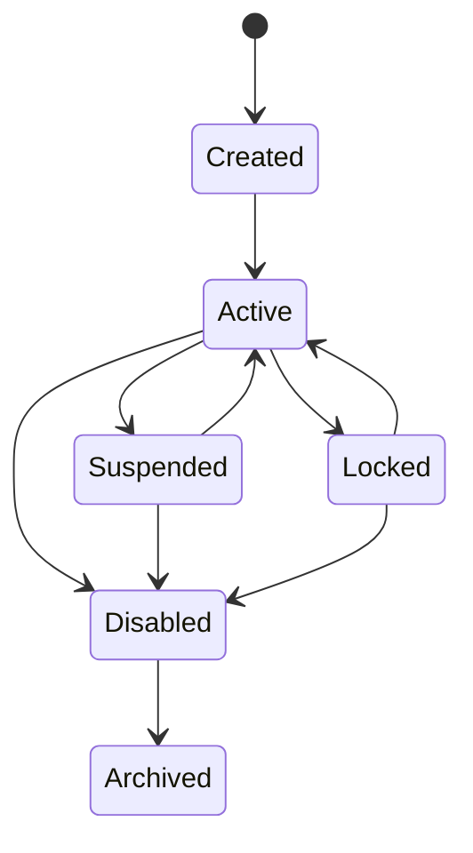
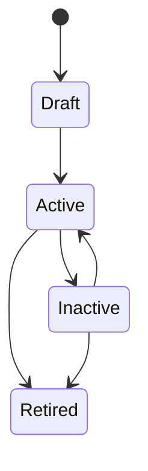
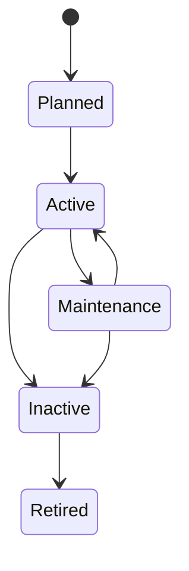
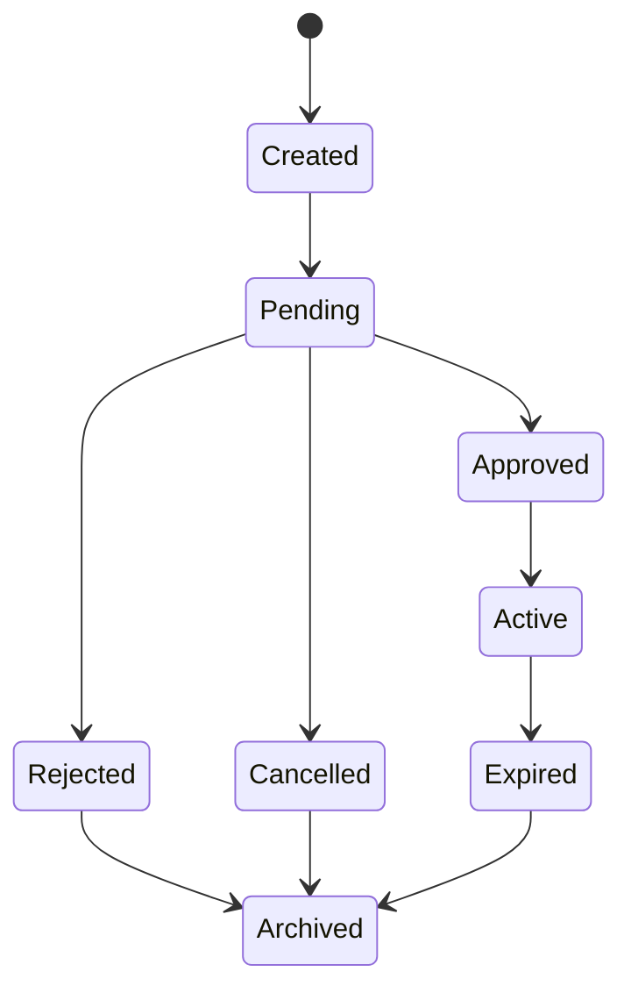
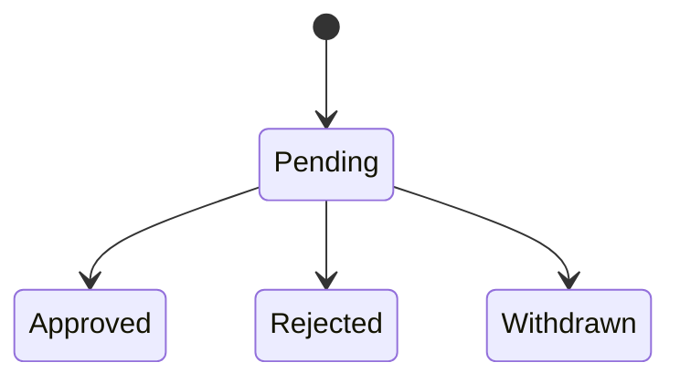
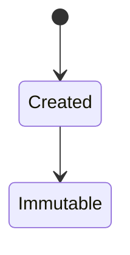
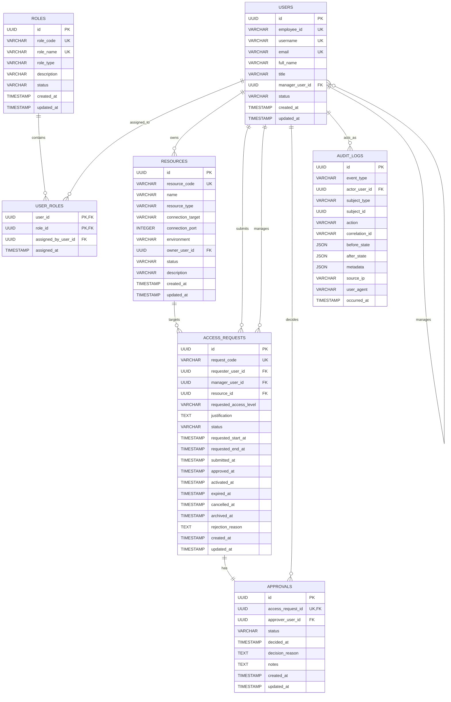

# OpsForge Version 1 Domain and Database Design

## 1. Domain Overview

OpsForge Version 1 is a cloud-native just-in-time privileged access management platform with local user management only. The domain is intentionally small and enterprise-oriented: users request temporary privileged access to protected resources, approvals are recorded, and every significant business event is audited.

The frozen architecture already separates the codebase into `identity/`, `roles/`, `resources/`, `access/`, `approval/`, and `audit/`. This design follows that boundary model exactly and does not introduce new architectural layers or feature packages.

### Version 1 Design Principles

- Local identity only. No Active Directory, LDAP, Azure AD, Okta, Keycloak, or AWS IAM.
- Keep the model normalized to 3NF where practical.
- Prefer enums for controlled business vocabularies instead of lookup tables unless a table is clearly justified.
- Use immutable audit records.
- Use explicit status fields instead of soft delete for most business entities.
- Keep approval simple in V1: one approval record per access request.
- Use UUID primary keys for scalability and safer distributed growth.
- Snapshot manager ownership at request creation so approval routing is deterministic.

### Business Boundary Ownership

- `identity/` owns `User`.
- `roles/` owns `Role` and the user-to-role membership table.
- `resources/` owns `Resource`.
- `access/` owns `AccessRequest`.
- `approval/` owns `Approval`.
- `audit/` owns `AuditLog`.

## 2. Core Business Entities

### Supporting Entity Justification

A single supporting entity is required in Version 1:

- `UserRole`: a join table that models the many-to-many relationship between users and roles.

This is not over-engineering. It is the minimum relational structure needed because one user can have multiple roles and one role can be assigned to many users.

No `Department`, `Permission`, or `ResourceType` table is introduced in Version 1. Those concepts are better represented as enums or future expansion items because they are not required to support the core request-approval-audit flow.

## 3. Entity Responsibilities

### 3.1 User

**Purpose**  
Represents a local OpsForge identity that can own resources, submit requests, approve requests, and be audited.

**Responsibilities**  
- Store user identity and account state.
- Support manager/self-reference for reporting or approval routing.
- Support multiple role memberships.
- Act as the actor for requests, approvals, and audit events.

**Business Description**  
A user is a local business account, not an external directory identity. The account may represent an employee, administrator, approver, or auditor.

**Relationships**  
- Many-to-many with `Role` through `UserRole`.
- One-to-many with `AccessRequest` as requester.
- One-to-many with `Resource` as owner.
- One-to-many with `Approval` as approver.
- One-to-many with `AuditLog` as actor.
- Optional self-reference to another `User` as manager.

**Lifecycle**  
Created -> Active -> Suspended/Locked -> Disabled -> Archived

### 3.2 Role

**Purpose**  
Defines a local application authorization role used to categorize user privileges.

**Responsibilities**  
- Group users by business responsibility.
- Distinguish system-defined roles from custom roles.
- Support approval and auditing workflows through membership.

**Business Description**  
Roles in Version 1 are local and application-specific. They do not represent external directory groups or IAM policies.

**Relationships**  
- Many-to-many with `User` through `UserRole`.

**Lifecycle**  
Draft -> Active -> Inactive -> Retired

### 3.3 Resource

**Purpose**  
Represents a protected target system or asset for which privileged access may be requested.

**Responsibilities**  
- Store resource metadata.
- Identify the target host, endpoint, or asset.
- Track owner and operational status.
- Provide the object referenced by access requests.

**Business Description**  
A resource is the thing being accessed, such as a server, database, network device, application, or similar privileged target. Version 1 stores metadata only and does not manage credentials or session brokering.

**Relationships**  
- Many-to-one with `User` as owner.
- One-to-many with `AccessRequest`.

**Lifecycle**  
Planned -> Active -> Maintenance -> Inactive -> Retired

### 3.4 Access Request

**Purpose**  
Represents a time-bound request for privileged access to a resource.

**Responsibilities**  
- Capture the requestor, resource, requested access level, and justification.
- Track request status across its full lifecycle.
- Hold the scheduled access window.
- Serve as the parent record for the approval decision.

**Business Description**  
This is the central business transaction in OpsForge. A user requests temporary access to a resource for a specific purpose and time window. The request becomes the operational record for review, approval, activity, expiry, and archival.

**Relationships**  
- Many-to-one with `User` as requester.
- Many-to-one with `User` as manager snapshot approver.
- Many-to-one with `Resource`.
- One-to-one with `Approval` in Version 1.
- Referenced by `AuditLog` through polymorphic subject fields.

**Lifecycle ownership**  
The `AccessRequest` is the parent workflow record. Its status is the authoritative request lifecycle state. The request lifecycle drives the approval lifecycle, but the two records must never disagree.

At request creation time, the current manager of the requester is snapshotted into `access_requests.manager_user_id`. That snapshot is immutable for the life of the request and is the only manager allowed to approve the request. This prevents approval routing from changing if the requester's manager changes later.

An `Approval` may change the request from `created` to `pending`, from `pending` to `approved`, or from `pending` to `rejected`. Once the request reaches `approved`, `rejected`, `cancelled`, or `archived`, the approval record must reflect the same terminal decision state.

Contradictory states are not allowed. For example, `AccessRequest = approved` with `Approval = rejected` must fail validation and must not be persisted.

**Lifecycle**  
Created -> Pending -> Approved -> Active -> Expired -> Archived

Alternate terminal paths:

- Created -> Pending -> Rejected -> Archived
- Created -> Pending -> Cancelled -> Archived

### 3.5 Approval

**Purpose**  
Represents the review and decision made against an access request.

**Responsibilities**  
- Record the approver and the decision.
- Store the decision timestamp and reason.
- Enforce a single approval record per request in Version 1.

**Business Description**  
An approval is the authoritative decision record for an access request. It does not exist independently; it always belongs to a request.

**Relationships**  
- One-to-one with `AccessRequest`.
- Many-to-one with `User` as approver.

The approver must be the snapshotted manager stored on the request. Approval by any other user is invalid in Version 1.

**Lifecycle ownership**  
The `Approval` lifecycle is subordinate to the request lifecycle. It exists to capture the decision and decision metadata, not to define an independent workflow. A pending approval can exist only while the request is pending. A terminal approval decision must synchronize with the terminal request state.

**Lifecycle**  
Pending -> Approved / Rejected / Withdrawn

### 3.6 Audit Log

**Purpose**  
Stores immutable business and security events for traceability and compliance.

**Responsibilities**  
- Record who performed an action.
- Record what changed, when, and in what context.
- Preserve history permanently.

**Business Description**  
Audit records are append-only. They are not edited or deleted because the point of the log is historical truth, not operational state.

Audit logs are immutable operational evidence. They are retained for the full configured retention period and are not subject to business-process deletion.

**Relationships**  
- Many-to-one with `User` as actor, nullable for system-generated events.
- Polymorphic association to the subject entity via `subject_type` and `subject_id` fields.

**Lifecycle**  
Created -> Immutable

### 3.7 UserRole

**Purpose**  
Represents membership between a user and a role.

**Responsibilities**  
- Enforce many-to-many membership.
- Prevent duplicate user-role assignments.
- Allow auditing of role assignment events.

**Business Description**  
This is a linking table, not a standalone business process. It exists because role assignment is a true many-to-many relationship.

**Relationships**  
- Many-to-one with `User`.
- Many-to-one with `Role`.
- Optionally many-to-one with `User` as the assigning administrator.

**Lifecycle**  
Assigned -> Revoked

## 4. Delete and Retention Policy

### 4.1 Policy Summary

- `User`: restricted delete in practice; hard delete is not part of Version 1 operations. Use status changes instead.
- `Role`: restricted delete in practice; hard delete is not part of Version 1 operations. Use status changes instead.
- `Resource`: restricted delete in practice; hard delete is not part of Version 1 operations. Use status changes instead.
- `AccessRequest`: restricted delete; historical request records must remain available.
- `Approval`: restricted delete; historical decisions must remain available.
- `AuditLog`: hard delete prohibited and logically immutable.
- `UserRole`: restricted delete; membership history should be preserved through status and audit even if the row is removed in a controlled maintenance path.

### 4.2 Rationale

Version 1 is an audit-sensitive enterprise system. Historical business records must not disappear. Status-based lifecycle management is preferred over physical deletion for core entities. Where deletion is ever necessary, it must be restricted by foreign keys and operational policy, not used as the normal lifecycle mechanism.

Audit logs are append-only evidence and must never be deleted by application behavior.

## 5. Foreign Key Delete Behavior

### 5.1 users.manager_user_id -> users.id

- Delete behavior: `RESTRICT`
- Why: a manager relationship is business-critical and should not be broken by deleting users. User deletion is not a normal Version 1 operation.

### 5.2 user_roles.user_id -> users.id

- Delete behavior: `RESTRICT`
- Why: role membership must not survive the removal of the referenced user through a cascade. Use status changes instead.

### 5.3 user_roles.role_id -> roles.id

- Delete behavior: `RESTRICT`
- Why: role membership history should not vanish if a role is retired or removed.

### 5.4 user_roles.assigned_by_user_id -> users.id

- Delete behavior: `SET NULL`
- Why: assignment provenance is useful, but the membership row must remain valid even if the assigning admin is no longer available. The link is informational, not transactional.

### 5.5 resources.owner_user_id -> users.id

- Delete behavior: `RESTRICT`
- Why: resources must not become ownerless because the owner account disappeared. Ownership must be reassigned or the user status must change instead.

### 5.6 access_requests.requester_user_id -> users.id

- Delete behavior: `RESTRICT`
- Why: requests are historical records and must preserve their originator.

### 5.7 access_requests.manager_user_id -> users.id

- Delete behavior: `RESTRICT`
- Why: the snapshot manager is part of the request history and must remain valid for the lifetime of the request.

### 5.8 access_requests.resource_id -> resources.id

- Delete behavior: `RESTRICT`
- Why: requests must always point to the original resource record.

### 5.9 approvals.access_request_id -> access_requests.id

- Delete behavior: `RESTRICT`
- Why: approval records cannot exist without their request, and request history must remain.

### 5.10 approvals.approver_user_id -> users.id

- Delete behavior: `RESTRICT`
- Why: approval provenance must remain intact. The approver can be disabled, but the historical decision record must remain linked.

### 5.11 audit_logs.actor_user_id -> users.id

- Delete behavior: `SET NULL`
- Why: the audit record must survive even if the actor account is later removed by exceptional maintenance. Historical evidence takes priority over referential convenience.

### 5.12 audit_logs subject fields

- `subject_type` and `subject_id` are polymorphic and do not use a database FK delete action.
- Why: audit must remain generic and cannot depend on one FK per subject entity.

## 4. Table Designs

### 4.1 users

| Column | Type | Nullable | Default | Unique | FK | Index | Notes |
|---|---|---:|---|---:|---|---:|---|
| id | UUID | No | generated UUID | Yes | - | Primary key | Surrogate business key |
| employee_id | VARCHAR(50) | No | none | Yes | - | Yes | Human-readable enterprise identity |
| username | VARCHAR(80) | No | none | Yes | - | Yes | Local login name |
| email | VARCHAR(254) | No | none | Yes | - | Yes | Must be unique and valid |
| full_name | VARCHAR(200) | No | none | No | - | Yes | Display name |
| title | VARCHAR(120) | Yes | null | No | - | No | Job title or internal role label |
| manager_user_id | UUID | Yes | null | No | users.id | Yes | Self-reference to manager |
| status | VARCHAR(20) | No | 'active' | No | - | Yes | Controlled by UserStatus enum |
| last_login_at | TIMESTAMP WITH TIME ZONE | Yes | null | No | - | Yes | Optional operational metadata |
| created_at | TIMESTAMP WITH TIME ZONE | No | CURRENT_TIMESTAMP | No | - | Yes | Creation timestamp |
| updated_at | TIMESTAMP WITH TIME ZONE | No | CURRENT_TIMESTAMP | No | - | Yes | Update timestamp |

**Design notes**

- `employee_id`, `username`, and `email` are all unique because they serve different business purposes.
- `manager_user_id` is nullable to avoid forcing a management chain on service or bootstrap accounts.
- `status` is preferred over deletion for account lifecycle control.

**Delete policy**

- Hard delete: restricted in practice.
- Soft delete: not used as the primary pattern; use `status` instead.
- Restricted delete: yes.
- Cascade delete: no.

**Recommended SQLAlchemy types**

- `UUID(as_uuid=True)` for `id` and `manager_user_id` in PostgreSQL; use `String(36)` only if a cross-database fallback is required.
- `String` for text fields.
- `DateTime(timezone=True)` for timestamps.

### 4.2 roles

| Column | Type | Nullable | Default | Unique | FK | Index | Notes |
|---|---|---:|---|---:|---|---:|---|
| id | UUID | No | generated UUID | Yes | - | Primary key | Surrogate business key |
| role_code | VARCHAR(60) | No | none | Yes | - | Yes | Stable technical identifier |
| role_name | VARCHAR(120) | No | none | Yes | - | Yes | Human-readable label |
| role_type | VARCHAR(20) | No | 'custom' | No | - | Yes | Controlled by RoleType enum |
| description | VARCHAR(500) | Yes | null | No | - | No | Optional explanatory text |
| status | VARCHAR(20) | No | 'active' | No | - | Yes | Controlled by RoleStatus enum |
| created_at | TIMESTAMP WITH TIME ZONE | No | CURRENT_TIMESTAMP | No | - | Yes | Creation timestamp |
| updated_at | TIMESTAMP WITH TIME ZONE | No | CURRENT_TIMESTAMP | No | - | Yes | Update timestamp |

**Design notes**

- `role_code` is the stable technical key; `role_name` is the human-facing label.
- `role_type` is used to distinguish built-in operational roles from custom roles.
- Role retirement should not delete historical membership references.

**Delete policy**

- Hard delete: restricted in practice.
- Soft delete: not used as the primary pattern; use `status` instead.
- Restricted delete: yes.
- Cascade delete: no.

**Recommended SQLAlchemy types**

- `UUID(as_uuid=True)` for `id`.
- `String` for all text fields.
- `DateTime(timezone=True)` for timestamps.

### 4.3 user_roles

| Column | Type | Nullable | Default | Unique | FK | Index | Notes |
|---|---|---:|---|---:|---|---:|---|
| user_id | UUID | No | none | Part of PK | users.id | Yes | Membership owner |
| role_id | UUID | No | none | Part of PK | roles.id | Yes | Assigned role |
| assigned_by_user_id | UUID | Yes | null | No | users.id | Yes | Who granted the role |
| assigned_at | TIMESTAMP WITH TIME ZONE | No | CURRENT_TIMESTAMP | No | - | Yes | When the assignment happened |

**Primary key**

- Composite primary key: (`user_id`, `role_id`)

**Design notes**

- Composite key prevents duplicate membership rows.
- `assigned_by_user_id` is optional because some initial seeds may be system-generated.
- If later historical role-assignment tracking is needed, this table can be extended without changing the relationship model.

**Delete policy**

- Hard delete: restricted.
- Soft delete: no.
- Restricted delete: yes.
- Cascade delete: no.

**Recommended SQLAlchemy types**

- `UUID(as_uuid=True)` for the FK columns.
- `DateTime(timezone=True)` for `assigned_at`.

### 4.4 resources

| Column | Type | Nullable | Default | Unique | FK | Index | Notes |
|---|---|---:|---|---:|---|---:|---|
| id | UUID | No | generated UUID | Yes | - | Primary key | Surrogate business key |
| resource_code | VARCHAR(80) | No | none | Yes | - | Yes | Stable technical identifier |
| name | VARCHAR(150) | No | none | No | - | Yes | Display name |
| resource_type | VARCHAR(30) | No | none | No | - | Yes | Controlled by ResourceType enum |
| connection_target | VARCHAR(255) | No | none | No | - | Yes | Hostname, IP, URI, or equivalent target |
| connection_port | INTEGER | Yes | null | No | - | No | Optional port number |
| environment | VARCHAR(20) | No | 'production' | No | - | Yes | Controlled by ResourceEnvironment enum |
| owner_user_id | UUID | No | none | No | users.id | Yes | Accountability owner |
| status | VARCHAR(20) | No | 'active' | No | - | Yes | Controlled by ResourceStatus enum |
| description | VARCHAR(500) | Yes | null | No | - | No | Optional notes |
| created_at | TIMESTAMP WITH TIME ZONE | No | CURRENT_TIMESTAMP | No | - | Yes | Creation timestamp |
| updated_at | TIMESTAMP WITH TIME ZONE | No | CURRENT_TIMESTAMP | No | - | Yes | Update timestamp |

**Design notes**

- Every resource must have an owner for governance.
- `connection_target` is metadata only. Credentials are intentionally out of scope for Version 1.
- `resource_code` makes resource references stable even if the display name changes.

**Delete policy**

- Hard delete: restricted in practice.
- Soft delete: not used as the primary pattern; use `status` instead.
- Restricted delete: yes.
- Cascade delete: no.

**Recommended SQLAlchemy types**

- `UUID(as_uuid=True)` for `id` and `owner_user_id`.
- `Integer` for `connection_port`.
- `String` for target and text fields.
- `DateTime(timezone=True)` for timestamps.

### 4.5 access_requests

| Column | Type | Nullable | Default | Unique | FK | Index | Notes |
|---|---|---:|---|---:|---|---:|---|
| id | UUID | No | generated UUID | Yes | - | Primary key | Surrogate business key |
| request_code | VARCHAR(80) | No | none | Yes | - | Yes | Stable request reference |
| requester_user_id | UUID | No | none | No | users.id | Yes | Request originator |
| manager_user_id | UUID | No | none | No | users.id | Yes | Snapshotted manager responsible for approval |
| resource_id | UUID | No | none | No | resources.id | Yes | Target resource |
| requested_access_level | VARCHAR(30) | No | none | No | - | Yes | Controlled by AccessLevel enum |
| justification | TEXT | No | none | No | - | Full-text candidate | Business reason for access |
| status | VARCHAR(20) | No | 'created' | No | - | Yes | Controlled by AccessRequestStatus enum |
| requested_start_at | TIMESTAMP WITH TIME ZONE | No | none | No | - | Yes | Requested JIT start time |
| requested_end_at | TIMESTAMP WITH TIME ZONE | No | none | No | - | Yes | Requested JIT end time |
| submitted_at | TIMESTAMP WITH TIME ZONE | Yes | null | No | - | Yes | Set when moved to pending |
| approved_at | TIMESTAMP WITH TIME ZONE | Yes | null | No | - | Yes | Set when approved |
| activated_at | TIMESTAMP WITH TIME ZONE | Yes | null | No | - | Yes | Set when access becomes active |
| expired_at | TIMESTAMP WITH TIME ZONE | Yes | null | No | - | Yes | Set when access window ends |
| cancelled_at | TIMESTAMP WITH TIME ZONE | Yes | null | No | - | Yes | Set when cancelled |
| archived_at | TIMESTAMP WITH TIME ZONE | Yes | null | No | - | Yes | Set when archived |
| rejection_reason | TEXT | Yes | null | No | - | No | Required when rejected |
| created_at | TIMESTAMP WITH TIME ZONE | No | CURRENT_TIMESTAMP | No | - | Yes | Creation timestamp |
| updated_at | TIMESTAMP WITH TIME ZONE | No | CURRENT_TIMESTAMP | No | - | Yes | Update timestamp |

**Design notes**

- This table is the business transaction record for JIT access.
- The request stores both the approval state and the timing state so the lifecycle can be understood without joining a separate grant table in Version 1.
- `request_code` should be human-friendly for support and audit use.
- `requested_start_at` and `requested_end_at` define a finite access window.
- `manager_user_id` snapshots the requester’s current manager at creation time and does not change if the requester is later reassigned.

**Delete policy**

- Hard delete: restricted.
- Soft delete: no.
- Restricted delete: yes.
- Cascade delete: no.

**Recommended SQLAlchemy types**

- `UUID(as_uuid=True)` for `id`, `requester_user_id`, and `resource_id`.
- `Text` for justification and rejection reasoning.
- `DateTime(timezone=True)` for all temporal fields.

### 4.6 approvals

| Column | Type | Nullable | Default | Unique | FK | Index | Notes |
|---|---|---:|---|---:|---|---:|---|
| id | UUID | No | generated UUID | Yes | - | Primary key | Surrogate business key |
| access_request_id | UUID | No | none | Yes | access_requests.id | Yes | Exactly one approval per request in V1 |
| approver_user_id | UUID | No | none | No | users.id | Yes | Decision maker |
| status | VARCHAR(20) | No | 'pending' | No | - | Yes | Controlled by ApprovalStatus enum |
| decided_at | TIMESTAMP WITH TIME ZONE | Yes | null | No | - | Yes | Set once a decision is made |
| decision_reason | TEXT | Yes | null | No | - | No | Explanation for approval or rejection |
| notes | TEXT | Yes | null | No | - | No | Optional reviewer commentary |
| created_at | TIMESTAMP WITH TIME ZONE | No | CURRENT_TIMESTAMP | No | - | Yes | Creation timestamp |
| updated_at | TIMESTAMP WITH TIME ZONE | No | CURRENT_TIMESTAMP | No | - | Yes | Update timestamp |

**Design notes**

- `access_request_id` is unique to enforce one approval record per request in Version 1.
- `approver_user_id` must reference an active, authorized user.
- The decision is intentionally stored here rather than on the request alone so that the workflow remains auditable and extensible.

**Delete policy**

- Hard delete: restricted.
- Soft delete: no.
- Restricted delete: yes.
- Cascade delete: no.

**Recommended SQLAlchemy types**

- `UUID(as_uuid=True)` for `id`, `access_request_id`, and `approver_user_id`.
- `Text` for narrative decision content.
- `DateTime(timezone=True)` for timestamps.

### 4.7 audit_logs

| Column | Type | Nullable | Default | Unique | FK | Index | Notes |
|---|---|---:|---|---:|---|---:|---|
| id | UUID | No | generated UUID | Yes | - | Primary key | Surrogate business key |
| event_type | VARCHAR(50) | No | none | No | - | Yes | Controlled by AuditEventType enum |
| actor_user_id | UUID | Yes | null | No | users.id | Yes | Actor responsible for the event |
| subject_type | VARCHAR(50) | No | none | No | - | Yes | Entity name such as User or AccessRequest |
| subject_id | UUID | No | none | No | - | Yes | Polymorphic subject identifier |
| action | VARCHAR(50) | No | none | No | - | Yes | Business action, often similar to event type |
| correlation_id | VARCHAR(100) | Yes | null | No | - | Yes | Request or trace correlation value |
| before_state | JSON | Yes | null | No | - | No | Optional snapshot before change |
| after_state | JSON | Yes | null | No | - | No | Optional snapshot after change |
| metadata | JSON | Yes | null | No | - | No | Extra contextual values |
| source_ip | VARCHAR(45) | Yes | null | No | - | Yes | IPv4 or IPv6 |
| user_agent | VARCHAR(255) | Yes | null | No | - | No | Request client hint |
| occurred_at | TIMESTAMP WITH TIME ZONE | No | CURRENT_TIMESTAMP | No | - | Yes | Event timestamp |

**Design notes**

- Audit logs are append-only.
- Polymorphic `subject_type` and `subject_id` are used instead of foreign keys so one log table can capture events for every domain entity.
- `before_state` and `after_state` are JSON because audit payloads vary by entity.

**Delete policy**

- Hard delete: prohibited.
- Soft delete: not applicable.
- Restricted delete: yes.
- Cascade delete: no.

**Recommended SQLAlchemy types**

- `UUID(as_uuid=True)` for `id`, `actor_user_id`, and `subject_id`.
- `JSON` for state snapshots and metadata.
- `DateTime(timezone=True)` for `occurred_at`.

## Database Check Constraints

These checks are the minimum row-level constraints that belong in Version 1. Cross-table lifecycle synchronization is enforced transactionally, not through a cross-row CHECK.

- `users.manager_user_id IS NULL OR users.manager_user_id <> users.id`
- `access_requests.manager_user_id <> access_requests.requester_user_id`
- `resources.connection_port IS NULL OR (resources.connection_port BETWEEN 1 AND 65535)`
- `access_requests.requested_end_at > access_requests.requested_start_at`
- `approvals.decided_at IS NULL OR approvals.status IN ('pending', 'approved', 'rejected', 'withdrawn')`
- `access_requests.approved_at IS NULL OR access_requests.status IN ('approved', 'active', 'expired', 'archived')`

The request/approval synchronization rule is enforced by the single-approval-per-request structure plus transactional update logic. It is not a pure single-row CHECK constraint.

## 5. Relationships

### 5.1 One-to-Many

- One `User` can own many `Resource` records.
- One `User` can submit many `AccessRequest` records.
- One `Resource` can appear in many `AccessRequest` records over time.
- One `User` can act as approver for many `Approval` records.
- One `User` can generate many `AuditLog` records.

### 5.2 Many-to-Many

- One `User` can have many `Role` records.
- One `Role` can belong to many `User` records.

This is implemented through `UserRole` because the relationship is genuinely many-to-many and should not be flattened into a single foreign key.

### 5.3 One-to-One

- One `AccessRequest` has exactly one `Approval` in Version 1.

This keeps the approval workflow simple and prevents multiple concurrent decisions for the same request.

### 5.4 Self Relationship

- A `User` may reference another `User` as manager.

This is useful for reporting chains and future approval routing.

### 5.5 Polymorphic Relationship

- `AuditLog` references any business entity through `subject_type` and `subject_id`.

This avoids a separate audit table per entity and keeps the design normalized enough for Version 1 without overcomplication.

## 6. Enumerations

### 6.1 UserStatus

Recommended values:

- `active`
- `suspended`
- `locked`
- `disabled`
- `archived`

### 6.2 RoleType

Recommended values:

- `system`
- `custom`

### 6.3 RoleStatus

Recommended values:

- `active`
- `inactive`
- `retired`

### 6.4 ResourceType

Recommended values:

- `server`
- `database`
- `application`
- `network_device`

### 6.5 ResourceEnvironment

Recommended values:

- `development`
- `testing`
- `staging`
- `production`

### 6.6 ResourceStatus

Recommended values:

- `planned`
- `active`
- `maintenance`
- `inactive`
- `retired`

### 6.7 AccessLevel

Recommended values:

- `read_only`
- `standard`
- `elevated`
- `break_glass`

### 6.8 AccessRequestStatus

Recommended values:

- `created`
- `pending`
- `approved`
- `active`
- `expired`
- `rejected`
- `cancelled`
- `archived`

### 6.9 ApprovalStatus

Recommended values:

- `pending`
- `approved`
- `rejected`
- `withdrawn`

### 6.10 AuditEventType

Recommended values:

- `user_created`
- `user_updated`
- `user_status_changed`
- `role_created`
- `role_assigned`
- `role_revoked`
- `resource_created`
- `resource_updated`
- `resource_status_changed`
- `access_request_created`
- `access_request_submitted`
- `access_request_approved`
- `access_request_rejected`
- `access_request_cancelled`
- `access_request_expired`
- `approval_recorded`
- `system_event`

## 7. Business Rules

1. A disabled, suspended, locked, or archived user cannot submit a new access request.
2. A request must reference an active resource.
3. A request must reference an active requester.
4. A request must have a finite start and end time, and the end time must be after the start time.
5. A request cannot exceed the approved maximum access window for the organization.
6. A request justification is required and must be long enough to be actionable, not a placeholder phrase.
7. An approval cannot exist without a request.
8. A request can have only one approval record in Version 1.
9. A pending approval must belong to an active approver with the right role.
10. A request cannot be approved after it has expired.
11. A request cannot be approved if it has been cancelled or rejected.
12. A request cannot transition from rejected or cancelled back to pending without creating a new request.
13. A user cannot be their own manager.
14. A manager reference, when present, must point to an existing active user.
15. A role assignment must not duplicate an existing user-role pair.
16. An inactive or retired role cannot be newly assigned.
17. A resource must always have an owner user.
18. A resource marked retired cannot receive new access requests.
19. An audit log must never be updated or deleted.
20. Audit events should be created for lifecycle transitions on users, roles, resources, requests, approvals, and role assignments.
21. A requester must never approve their own access request.
22. An access request and its approval must always agree on terminal state.
23. A request in `approved` state must not coexist with an approval in `rejected` state, and vice versa.
24. A request and its approval must move to terminal states together.

## 8. Validation Rules

### User validations

- `email` must be present, syntactically valid, and unique.
- `username` must be present and unique.
- `employee_id` must be present and unique.
- `full_name` must be present.
- `manager_user_id`, when supplied, must reference an existing active user.
- `status` must be one of the supported UserStatus values.
- `manager_user_id` must not equal the user's own `id`.

### Role validations

- `role_code` must be present and unique.
- `role_name` must be present and unique.
- `role_type` must be one of the supported RoleType values.
- `status` must be one of the supported RoleStatus values.

### Resource validations

- `resource_code` must be present and unique.
- `name` must be present.
- `resource_type` must be valid.
- `connection_target` must be present and must not be blank.
- `connection_port`, when supplied, must be within the valid TCP/UDP range.
- `owner_user_id` must reference an existing user.
- `status` must be valid.

### Access request validations

- `request_code` must be present and unique.
- `requester_user_id` must reference an existing user.
- `manager_user_id` must reference the requester's current active manager at creation time.
- `resource_id` must reference an existing resource.
- `requested_access_level` must be valid.
- `justification` must meet minimum length requirements.
- `requested_start_at` and `requested_end_at` must both be supplied and ordered correctly.
- The request window must not exceed policy maximum.

### Approval validations

- `access_request_id` must reference an existing request.
- `approver_user_id` must reference an existing active user.
- The approver must have an authorized role.
- The approver must not be the same user as the requester.
- The approver must be the request's snapshotted manager.
- `decision_reason`, when the request is rejected, must be present.

### Audit log validations

- `event_type` must be valid.
- `subject_type` must not be blank.
- `subject_id` must be present.
- `occurred_at` must always be populated.
- Audit records must not be created for invalid or blocked business transitions.

## 9. Index Strategy

### High-value indexes

- `users.email` because it is a frequent identity lookup and must be unique.
- `users.username` because local login and administrative searches will use it frequently.
- `users.employee_id` because it is a business identifier used for support and integration later.
- `users.status` because operational screens filter by active/disabled accounts.
- `users.manager_user_id` because manager lookups are common.
- `roles.role_code` and `roles.role_name` because role assignment and administration need fast lookup.
- `roles.status` because inactive roles should be filtered quickly.
- `user_roles.user_id` and `user_roles.role_id` because both directions of membership lookup matter.
- `resources.resource_code` and `resources.name` because administrators search resources frequently.
- `resources.resource_type`, `resources.environment`, and `resources.status` because filtering by resource category is common.
- `resources.owner_user_id` because stewardship queries are common.
- `(access_requests.manager_user_id, access_requests.status)` because manager review queues are centered on the snapshotted approver and workflow state.
- `(access_requests.requester_user_id, access_requests.status)` because request queues are usually filtered by requester and workflow state together.
- `(access_requests.resource_id, access_requests.status)` because resource-specific queues need to combine target and state.
- `(access_requests.status, access_requests.requested_end_at)` because expiry processing is status-driven and time-sensitive.
- `approvals.access_request_id` because the request-to-approval lookup must be immediate.
- `(approvals.approver_user_id, approvals.status)` because reviewer work queues need both approver identity and decision state.
- `(audit_logs.subject_type, audit_logs.subject_id, audit_logs.occurred_at)` because audit review is typically subject-scoped and time-ordered.
- `(audit_logs.actor_user_id, audit_logs.occurred_at)` because security investigations often filter by actor and time.

### Indexing rationale

- Unique business identifiers are indexed because they are lookup keys.
- Foreign keys are indexed because joins and filters will use them often.
- Status columns are indexed because operational screens and reporting are status-centric.
- Composite indexes are preferred over single-column timestamp indexes because they match the actual access patterns and reduce write overhead.

## 10. Entity Lifecycle Diagrams

### 10.1 User

### 10.2 Role

### 10.3 Resource

### 10.4 Access Request

### 10.5 Approval

### 10.6 Audit Log

## 11. Mermaid ER Diagram

## 12. Architecture Decisions

1. **UUID primary keys**  
   Chosen for scalability, safer distributed generation, and better separation from future business numbering schemes.

2. **No Department table in Version 1**  
   The requirement can be satisfied without org hierarchy. Manager self-reference is enough for initial approval routing and reporting. Department would be a future expansion if organizational reporting becomes a must-have.

3. **Enums instead of lookup tables**  
    User status, role type, resource type, request status, approval status, and audit event type are all small controlled vocabularies. Enums keep Version 1 simple and avoid unnecessary table joins. `workflow` was removed from `RoleType`, and `secret_store` was removed from `ResourceType`, because they were premature for Version 1.

4. **One approval per access request**  
   Version 1 should not model a multi-stage approval chain. That would be valid in the future, but it adds avoidable complexity now.

5. **Polymorphic audit references**  
   A single audit table is more maintainable than one audit table per entity. Foreign keys are not used for the polymorphic subject because the audit system must remain generic.

6. **Status-driven lifecycle instead of hard delete**  
   Business records should generally remain in the database with explicit state transitions. This is cleaner for auditing and aligns with enterprise governance expectations.

7. **Request and approval lifecycle synchronization**  
    The approval record is a decision artifact, not a separate workflow. Request and approval statuses must stay synchronized so contradictory states cannot be persisted.

8. **Resource credentials are out of scope**  
   OpsForge Version 1 manages access requests and approvals, not credential vaulting or session execution.

## 13. Future Expansion Considerations

The following are intentionally deferred and should not be implemented in Version 1:

- Department or cost-center hierarchy.
- Multi-stage or policy-driven approval chains.
- Access grant/session execution tables.
- Credential vault integration.
- Resource tagging and classification catalogs.
- Delegated administration.
- External identity provider integration.
- Temporal history tables for role assignments and user changes beyond audit logging.
- Notification delivery tables or queues.
- Policy engine tables for fine-grained authorization rules.

These items are plausible later additions, but they are not required to ship a strong Version 1 foundation.

## 14. Architecture Review

The design is consistent with the frozen architecture and keeps each feature package focused on a single business concern. It is normalized enough for long-term maintainability, but it does not over-index on theoretical extensibility.

Strengths:

- Clear ownership by package.
- Small and understandable entity set.
- Explicit status-driven workflows.
- Strong auditability.
- Good support for future growth without forcing premature complexity.

## 15. Database Design Score

**Score: 94 / 100**

Rationale:

- The model is coherent, normalized, and implementable by a single developer.
- It covers the core JIT PAM lifecycle cleanly.
- It avoids unnecessary tables and avoids overfitting to enterprise hypotheticals.
- The main tradeoff is that polymorphic audit tracking reduces strict foreign-key enforcement for audit subjects, but that is a reasonable compromise for a generic audit log.

## 16. Potential Risks

- Approval workflow may need expansion sooner than expected if the business later requires multi-step review chains.
- Polymorphic audit subject fields are flexible, but they do not enforce referential integrity at the database level.
- UUIDs improve scalability, but they make some manual debugging and support tasks less human-friendly than integer keys.
- If resource access rules become more granular, Version 1 may need a later `Permission` or policy table.
- If organizational hierarchy becomes important, a `Department` or `Team` model may eventually be needed.

## 17. Suggestions for Phase 2.2

1. Implement SQLAlchemy models exactly from this design, including constraints, FK relationships, and indexes.
2. Add Alembic migrations with explicit unique constraints and composite keys.
3. Seed baseline roles such as admin, approver, requester, and auditor.
4. Add database-level checks for status values where the target dialect supports them, plus application-level validation everywhere else.
5. Add tests for unique constraints, lifecycle transitions, and forbidden state changes.
6. Add audit capture hooks after the model layer is in place.
7. Keep the implementation aligned with the package boundaries already frozen in the repository.

---

This document is intentionally implementation-free and is meant to be the authoritative design baseline for OpsForge Version 1.
