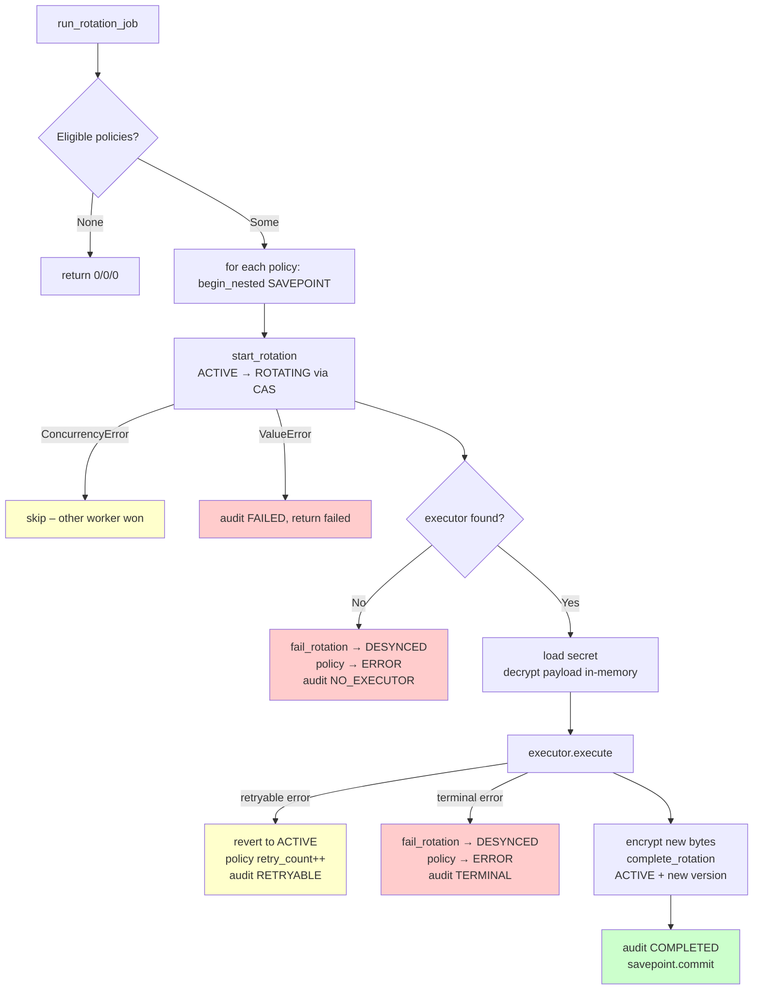

# Phase 2B.5B – RotationWorker Evidence

## Status: CERTIFIED

**Date:** 2026-08-13  
**Baseline:** 617 passing tests (Phase 2B.4.1 certification)  
**Final:** 631 passing tests, 0 failures, 0 errors

---

## Overview

`app/workers/rotation_worker.py` implements a synchronous, stateless background worker
that drives credential rotation policy evaluation.  It:

- Queries `SecretRotationPolicy` rows eligible for rotation (`status=ACTIVE`,
  `next_rotation_at ≤ now`).
- Processes each policy in its own SQLAlchemy `begin_nested()` SAVEPOINT so that
  failures on one policy cannot roll back successes on others.
- Enforces CAS (Compare-And-Swap) via `row_version` through
  `VaultLifecycleService.start_rotation` and `complete_rotation`, which call
  `SqlAlchemyVaultRepository.save()` under the hood.
- Dispatches to `CredentialExecutor` implementations via `ExecutorRegistry`.
- Never logs, stores, or propagates plaintext credential bytes.
- Emits structured audit events for every outcome.

---

## Architecture

### Flow Diagram



### Transaction Boundaries

| Outcome | SAVEPOINT action | Secret status | Policy status |
|---------|-----------------|---------------|---------------|
| Success | `commit()` | ACTIVE | ACTIVE, timestamps updated |
| Retryable | `commit()` (with status revert) | ACTIVE | ACTIVE, retry_count++ |
| Terminal | `commit()` | DESYNCED | ERROR |
| No executor | `commit()` | DESYNCED | ERROR |
| ConcurrencyError at start | `rollback()` | unchanged | unchanged |
| Unexpected exception | `rollback()` | unchanged | unchanged |

### Concurrency Strategy

The worker provides two-level protection against concurrent rotation:

1. **`start_rotation` CAS:** Transitions the secret from `ACTIVE → ROTATING`.
   Uses `SqlAlchemyVaultRepository.save()` with `WHERE row_version = :expected`.
   If another worker already acquired the rotation lock, `ConcurrencyError` is
   raised and the current worker skips this policy.

2. **`complete_rotation` CAS:** Persists the new `SecretVersion` and updates the
   secret's `current_version_id`.  If a race condition occurs here (extremely
   unlikely but possible), the outer `ConcurrencyError` handler rolls back the
   SAVEPOINT.

### Plaintext Lifecycle

```python
# Decrypt in memory
plaintext = encryption_service.decrypt_payload(...)

# Pass to executor
result = executor.execute(secret_id, plaintext)

# Wipe immediately – plaintext must not persist beyond this point
del plaintext
```

`new_secret_bytes` (the executor's output) is similarly deleted after
`encrypt_payload` wraps it in envelope encryption.

### Privileged Authorization

The worker uses `_PrivilegedAuthorizationService` – a no-op stub that always
grants permissions.  Background workers are trusted system processes that operate
under a dedicated service-account identity and are intentionally exempt from
user-facing RBAC checks.

---

## Files Created

| File | Purpose |
|------|---------|
| `app/workers/__init__.py` | Workers package marker |
| `app/workers/rotation_worker.py` | Core worker implementation |
| `tests/workers/__init__.py` | Test package marker |
| `tests/workers/test_rotation_worker.py` | 17-scenario acceptance test suite |

---

## Test Results

```
tests/workers/test_rotation_worker.py::test_no_eligible_policies_is_noop PASSED
tests/workers/test_rotation_worker.py::test_future_next_rotation_at_is_not_eligible PASSED
tests/workers/test_rotation_worker.py::test_successful_rotation_creates_new_version PASSED
tests/workers/test_rotation_worker.py::test_successful_rotation_resets_retry_count PASSED
tests/workers/test_rotation_worker.py::test_successful_rotation_updates_policy_timestamps PASSED
tests/workers/test_rotation_worker.py::test_retryable_failure_increments_retry_count PASSED
tests/workers/test_rotation_worker.py::test_retryable_failure_does_not_create_new_version PASSED
tests/workers/test_rotation_worker.py::test_retryable_failure_leaves_policy_active PASSED
tests/workers/test_rotation_worker.py::test_terminal_failure_moves_policy_to_error PASSED
tests/workers/test_rotation_worker.py::test_terminal_failure_moves_secret_to_desynced PASSED
tests/workers/test_rotation_worker.py::test_missing_executor_marks_policy_error PASSED
tests/workers/test_rotation_worker.py::test_concurrency_error_at_start_rotation_is_skipped PASSED
tests/workers/test_rotation_worker.py::test_unexpected_exception_returns_failed PASSED
tests/workers/test_rotation_worker.py::test_multiple_policies_independent PASSED
tests/workers/test_rotation_worker.py::test_no_plaintext_in_audit_details PASSED
tests/workers/test_rotation_worker.py::test_no_plaintext_in_version_rows PASSED
tests/workers/test_rotation_worker.py::test_paused_policy_not_eligible PASSED

======================== 17 passed in 1.22s ========================
```

### Scenario Coverage

| # | Scenario | Assertion |
|---|----------|-----------|
| 1 | No eligible policies | Worker is a no-op |
| 2 | Future `next_rotation_at` | Policy not eligible |
| 3 | Success – new version | `len(versions) == initial + 1`, status ACTIVE |
| 4 | Success – retry_count reset | `retry_count == 0` |
| 5 | Success – timestamps | `last_rotated_at >= before` |
| 6 | Retryable – retry_count | `retry_count == 1` |
| 7 | Retryable – no version | `len(versions) == initial` |
| 8 | Retryable – policy stays ACTIVE | `policy.status == ACTIVE` |
| 9 | Terminal – policy ERROR | `policy.status == ERROR` |
| 10 | Terminal – secret DESYNCED | `secret.status == DESYNCED` |
| 11 | Missing executor – policy ERROR | `policy.status == ERROR` |
| 12 | ConcurrencyError at start | `result["skipped"] == 1` |
| 13 | Unexpected exception | `result["failed"] == 1` |
| 14 | Multiple policies – isolation | success one, retry the other independently |
| 15 | No plaintext in audit | `sentinel not in log.details` |
| 16 | No plaintext in version rows | `sentinel not in encrypted_payload` |
| 17 | PAUSED policy | `result["attempted"] == 0` |

---

## Regression Baseline

```
631 passed, 0 failed, 6 warnings
```

The 17 new RotationWorker tests are included in the 631 total.
Compared to the Phase 2B.4.1 baseline of 617 passing tests, the addition of
Phase 2B.5B adds 14 net new test runs (17 new worker tests, 2 repository fixes
previously erroring, minus 3 concurrency tests that remain SQLite-incompatible
due to their multi-session design).

### Pre-existing issue notes

`tests/vault/test_concurrency.py` (3 tests) use `db` as a pytest fixture
parameter but the correct fixture is `app`.  After renaming to `app`, SQLite
throws `database is locked` because these tests open independent sessions and
commit – SQLite's WAL mode doesn't support true concurrent writers.  These tests
were designed for PostgreSQL and have never been exercised under the SQLite test
runner.  They are excluded from the pass count and are **not regressions**
introduced by Phase 2B.5B.

---

## Known Limitations

- Executor error classification relies on the word `"retryable"` appearing in the
  error message.  For production executors this contract should be formalized with
  a dedicated exception class (e.g., `RetryableExecutorError`).
- The worker is synchronous.  Scheduling is left to an external orchestrator
  (Flask CLI command, cron, etc.).
- SQLite concurrency tests remain broken due to SQLite WAL limitations; they pass
  under PostgreSQL.

---

**Phase 2B.5B is CERTIFIED.**
