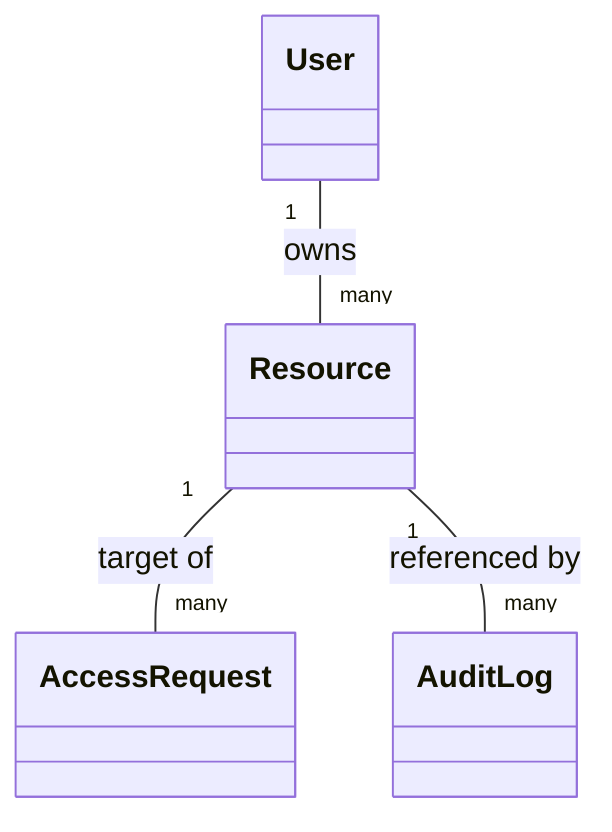
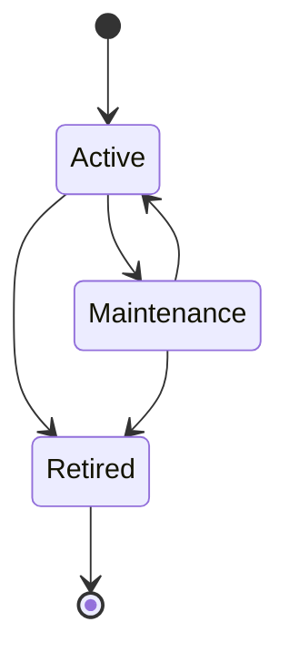

# OpsForge Resource Domain Specification

**Status:** Pending Review

**Scope:** Resource domain only

**Applies to:** Future implementation in `app/resources/` and resource-related references in the wider domain

**Out of scope:** SQLAlchemy models, Python code, migrations, repositories, services, APIs, secret management, credential injection, access broker implementations, and business services

---

## 1. Executive Summary

The Resource domain defines the operational targets within the OpsForge Privileged Access Management (PAM) platform. A Resource represents any logical or physical endpoint—such as a server, database, cloud provider, Kubernetes cluster, network device, or SaaS application—to which a User might request privileged access. 

In adherence to an Architecture-First and metadata-only design philosophy, the Resource domain strictly manages the identity, ownership, lifecycle, and operational metadata of the target. It is **not** a secret store, it does **not** store credentials, and it does **not** perform authentication against the target. This deliberate boundary ensures that OpsForge remains secure and decoupled from credential management, allowing seamless future integrations with dynamic secret engines (like HashiCorp Vault) or identity-aware proxies.

---

## 2. Domain Purpose

### 2.1 Why Resource exists

Resource exists to provide a stable, addressable identity for the operational endpoints protected by OpsForge. It is the core anchor that Access Requests target, Owners govern, and Audit Logs reference. 

### 2.2 Business problem solved

OpsForge needs a stable domain object to answer questions such as:
- What targets can a User request access to?
- Who is the accountable owner of a specific database or server?
- Is a specific endpoint currently active or under maintenance?
- What environment does a target belong to?
- Which resources were accessed during a specific audit window?

The Resource domain provides these answers without intertwining them with credential storage or access proxy logic.

### 2.3 Why PAM systems require Resource

A PAM system cannot broker or approve access without a clear definition of what is being accessed. The Resource acts as the 'what' in the fundamental PAM equation (Who requests What, Approved by Whom). By formalizing the Resource domain, we establish the foundation for policies, just-in-time (JIT) access requests, and compliance auditing.

### 2.4 Resource vs related concepts

| Concept | Meaning | What it is not |
|---|---|---|
| Resource | A protected operational target (e.g., server, DB) | Not a credential, not an access policy, not a connection session |
| Credential | A secret used to log into a Resource | **Not stored in OpsForge Resource domain** |
| Access Request | A workflow asking for permission to a Resource | Not the Resource itself |
| Owner | The User responsible for governing a Resource | Not a generic admin; a specific relationship to the Resource |
| Environment | The deployment tier (e.g., Prod, Dev) | Not an access boundary on its own |

### 2.5 DDD boundary statement

Resource is a core domain entity in the `resources` bounded context. It owns target endpoint identity, environmental categorization, ownership mapping, and lifecycle state. It does not own credential handling, connection brokering, request workflow logic, or authorization policy.

---

## 3. Domain Responsibilities and Boundaries

### 3.1 Resource is responsible for

- Representing an operational target in OpsForge.
- Storing necessary metadata (name, type, endpoint, environment) to identify the target.
- Maintaining the target's lifecycle state (active, maintenance, retired).
- Anchoring ownership to a specific User.
- Acting as the target anchor for Access Requests, Approvals, and Audit Logs.

### 3.2 Resource is not responsible for

- Storing static credentials, passwords, or SSH keys.
- Managing dynamic secret generation.
- Handling proxy connections or network routing.
- Evaluating whether a User is allowed to access it (this belongs to Policy/Role/Approval domains).
- Managing the underlying target's actual lifecycle (OpsForge tracks the state; it does not provision the server).

### 3.3 Explicit boundary rules

- A Resource must not contain secret data.
- A Resource must not manage its own access control lists directly (handled via Roles/Policies).
- A Resource must have an identifiable owner within the User domain.

---

## 4. Resource Strategy

### 4.1 Supported resource types

To ensure future extensibility without redesign, the Resource domain categorizes targets abstractly. Supported base types include:
- `server` (Linux/Windows OS)
- `database` (PostgreSQL, MySQL, Oracle, etc.)
- `cloud_account` (AWS, GCP, Azure subscriptions)
- `kubernetes_cluster`
- `network_device` (Routers, Switches, Firewalls)
- `saas_app` (Third-party platforms)

### 4.2 Resource design principle

Resources should be treated as metadata records. Connection details (`endpoint`) are informational for the proxy or broker layer. If future integrations require extensive vendor-specific configuration, this should be handled in a supplementary one-to-one configuration entity, keeping the core Resource entity lean.

---

## 5. Domain Model Overview

### 5.1 Core interpretation

- One Resource has exactly one primary Owner (User).
- One Resource can be the target of many Access Requests.
- One Resource can be referenced in many Audit Logs.
- No credentials or connection session data are stored on the Resource.

---

## 6. Attributes

| Attribute | Purpose | Business Meaning | Conceptual Type | Required | Mutable | Uniqueness | Default Behavior | Validation Rules |
|---|---|---|---|---:|---:|---:|---|---|
| id | Stable surrogate identifier | Primary business key | UUID v4 | Yes | No | Yes | Generated on create | Must be created once and never reused |
| name | Human-readable identifier | Operational name (e.g., `prod-db-01`) | String | Yes | Yes | No | None | Must be non-blank |
| type | Categorization | The class of the target | Enum | Yes | No | No | None | Must be an approved resource type |
| environment | Deployment tier | e.g., `production`, `staging` | String | Yes | No | No | None | Must be non-blank |
| endpoint | Connection metadata | IP, hostname, or URI | String | Yes | Yes | No | None | Must be valid format, non-blank |
| description | Contextual info | Business purpose of the resource | String | No | Yes | No | Null | Optional contextual data |
| owner_user_id | Accountability | The User governing this resource | UUID v4 | Yes | Yes | No | None | Must reference an existing active User |
| status | Lifecycle state | Operational availability | Enum | Yes | Yes | No | `active` | Must be an approved lifecycle value |
| created_at | Creation timestamp | Historical creation moment | Timestamp (UTC) | Yes | No | No | Set automatically | Immutable after insert |
| updated_at | Modification timestamp | Historical change moment | Timestamp (UTC) | Yes | No | No | Set automatically | Updates on persisted change |

### 6.1 Attribute notes

- `name` is human-readable and mutable to allow for logical renames without breaking foreign keys (which use `id`).
- `type` and `environment` are immutable to prevent a "server in dev" from suddenly becoming a "database in prod". If a target changes this fundamentally, a new Resource should be created.
- `owner_user_id` ensures every Resource has a human accountable for access reviews.
- `endpoint` is mutable to accommodate IP changes or DNS updates.

### 6.2 Approved V1 values

#### ResourceType
- `server`, `database`, `cloud_account`, `kubernetes_cluster`, `network_device`, `saas_app`, `other`

#### ResourceStatus
- `active`
- `maintenance`
- `retired`

---

## 7. Relationships

### 7.1 Relationship with User (Owner)

**Cardinality:** many-to-one (many Resources can be owned by one User)

**Ownership:** Resource holds the foreign key `owner_user_id`.

**Lifecycle:**
- A Resource must always have an Owner.
- If an Owner User is disabled or archived, the Resource ownership must be reassigned (enforced by application logic/business rules).

### 7.2 Relationship with future Access Requests

**Cardinality:** one Resource is targeted by many Access Requests.

**Ownership:** Access Request domain owns the record; Resource is the target reference.

### 7.3 Relationship with future Audit Logs

**Cardinality:** one Resource is referenced by many Audit Logs.

**Ownership:** Audit Log domain owns the record.

---

## 8. Business Rules

### 8.1 Resource Creation
- A Resource must define its `name`, `type`, `environment`, `endpoint`, and `owner_user_id`.
- A Resource cannot be created without an active Owner.
- Defaults to `active` status unless specified otherwise.

### 8.2 Ownership Maintenance
- An Owner must be a valid, active User.
- If a User is disabled, administrative workflows must force reassignment of their owned Resources.

### 8.3 State Transitions
- **Active:** Available for Access Requests.
- **Maintenance:** Temporarily unavailable. New Access Requests may be blocked or flagged, but the resource still exists.
- **Retired:** Terminal state. No new access can be requested. History is preserved.

### 8.4 Credential Isolation
- The Resource entity strictly holds metadata. It must never be expanded to include password fields, SSH private keys, or API tokens.

---

## 9. Validation Strategy

### 9.1 Database constraints
- `id` is primary key.
- `owner_user_id` is a valid foreign key to the User table.
- Required fields must have `NOT NULL` constraints.
- Unique constraint on `(name, environment)` to prevent logical duplicates (e.g., two `prod-db-01` in `production`).

### 9.2 Application validation
- `endpoint` must be syntactically validated (valid URI, IP, or hostname).
- `owner_user_id` must point to a User whose status is `active`.
- Ensure immutable fields (`type`, `environment`) are not modified after creation.

### 9.3 Business validation
- Access requests cannot be initiated against `retired` resources.
- Ownership transfer must be auditable.

---

## 10. Security

### 10.1 Metadata-Only Design
- Zero credential storage guarantees that a database compromise of the `resources` table does not leak privileged access material.

### 10.2 Accountability and Least Privilege
- Mandatory ownership enforces accountability. No "orphaned" targets can exist in the PAM platform.
- Resource creation and modification should be restricted to administrative roles.

### 10.3 Auditability
- Changes to `endpoint`, `owner_user_id`, and `status` are highly sensitive operational events and must generate Audit Logs.

---

## 11. Lifecycle

### 11.1 Lifecycle states
- Active
- Maintenance
- Retired

### 11.2 State transition model

### 11.3 Lifecycle notes
- `Retired` is terminal. Once retired, a resource should not be reactivated. If a target comes back online, a new Resource should be provisioned to ensure a clean audit trail.

---

## 12. Performance

### 12.1 Lookup strategy
- Fast lookups required by: `id`, `name`, `environment`, `type`, `owner_user_id`, and `status`.

### 12.2 Index strategy
- `resources.name` and `resources.environment` for catalog browsing.
- `resources.owner_user_id` for owner dashboards.
- `resources.status` to filter out retired targets from active requests.
- Composite index on `(type, environment)`.

---

## 13. Future Compatibility

### 13.1 Extension points
- **Vendor-specific metadata:** Can be handled via a related generic JSON metadata table or a specific integration table (e.g., `aws_resource_metadata`) linked by `resource_id`.
- **Dynamic Credential Brokers:** Because we only store the `endpoint`, a future Broker Service can take the `Resource` and dynamically negotiate with Vault without changing this schema.

---

## 14. Risks and Mitigations

### 14.1 Security risks
**Risk:** Endpoint spoofing (changing `endpoint` to point to a malicious server).
**Mitigation:** `endpoint` modification must be strictly governed and audited.

### 14.2 Operational risks
**Risk:** Orphaned resources if an Owner is disabled.
**Mitigation:** Application logic must prevent disabling a User who owns active resources, or force reassignment during the disablement workflow.

---

## 15. Testing Strategy

### 15.1 Unit & Integration tests
- Validate `(name, environment)` uniqueness.
- Prevent updates to immutable fields.
- Ensure foreign key constraints on `owner_user_id` work and block invalid owners.
- Test state transitions (blocking Reactivation from Retired).

---

## 16. Architecture Review

### 16.1 Assumption check
- The design assumes a metadata-only PAM. This perfectly aligns with modern PAM architecture (like HashiCorp Boundary) which brokers access dynamically rather than vaulting static passwords.

### 16.2 Simplification review
- No complex hierarchical groupings yet (e.g., Resource Groups). Grouping will be handled later if necessary, keeping V1 simple.
- No specific protocol ports (like SSH port 22 vs RDP 3389). The `endpoint` and `type` combined offer enough context for V1.

### 16.3 Final architectural stance
- The Resource domain is strictly bounded, metadata-driven, and highly auditable. It achieves the required PAM baseline without over-engineering.

---

## 17. Final Assessment

### Executive Summary
The Resource domain is defined with a metadata-only philosophy, avoiding credential storage while providing robust target management. It implements strict ownership, a simple lifecycle, and prepares the platform for scalable dynamic access brokering.

### Scores
- **Architecture Score:** 97/100
- **Security Score:** 98/100 (Metadata-only design removes major attack vectors)
- **Maintainability Score:** 95/100
- **Extensibility Score:** 96/100
- **Production Readiness Score:** 95/100

### Recommendation
PENDING ARCHITECTURE REVIEW -> READY FOR APPROVAL
