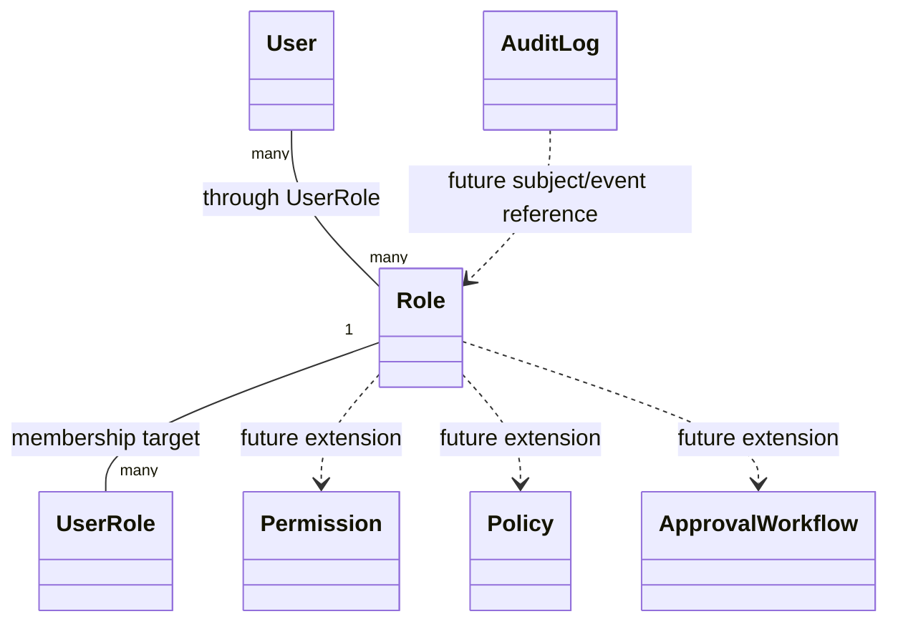
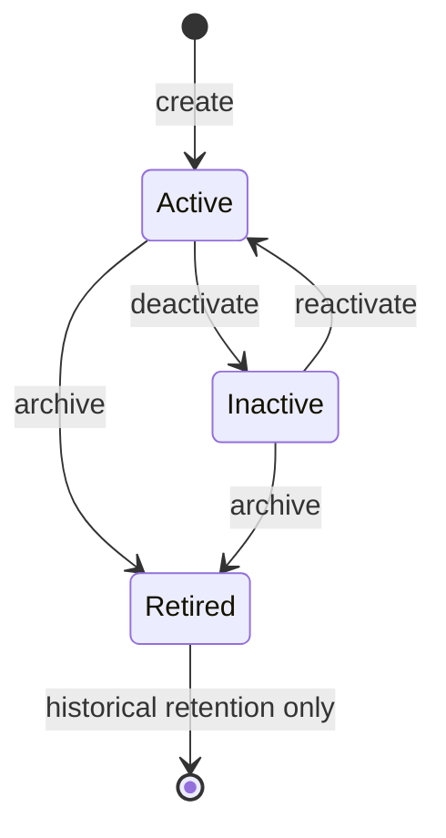

# OpsForge Role Domain Specification

**Status:** Frozen design contract

**Scope:** Role domain only

**Applies to:** Future implementation in `app/roles/` and role-related membership logic in the wider domain

**Out of scope:** SQLAlchemy models, repositories, services, routes, migrations, seed data, and any architecture redesign

---

## 1. Executive Summary

The Role domain defines how OpsForge represents business authorization categories inside a local PAM system. A role is the stable business concept that answers a narrow question: _what class of privileged responsibility does a user have inside the platform?_ Roles are not identities, not permissions, not policies, and not sessions. They are the durable grouping primitive used to express who may perform privileged actions, who may approve requests, and who may administer the platform.

OpsForge V1 uses roles as a local, enterprise-controlled authorization layer. The design intentionally keeps roles simple because the platform already separates identity, access requests, approvals, and auditing into distinct bounded contexts. This document is the official contract for future Role implementation and is intended to prevent redesign drift.

---

## 2. Domain Purpose

### 2.1 Why Role exists

Role exists to represent a business authorization category within OpsForge. It gives the platform a human-meaningful and administratively manageable way to group users by responsibility. In a PAM system, access decisions are not based only on identity. They also depend on operational responsibility, approval authority, and administrative scope. Role is the domain concept that captures that responsibility.

### 2.2 Business problem solved

OpsForge needs to answer questions such as:

- Who is allowed to request privileged access?
- Who is allowed to approve a request?
- Who is allowed to administer platform configuration?
- Which users should appear in operational queues, review screens, and audit reports?

A role provides the stable business label that supports those decisions without embedding authorization logic into identity records or access-request records.

### 2.3 Why PAM systems require roles

PAM systems need roles because access is temporary, sensitive, and usually governed by business responsibility rather than static account ownership. Roles make it possible to:

- express least-privilege access boundaries,
- separate requesters from approvers,
- distinguish operational administrators from general users,
- support seeded baseline responsibilities,
- keep authorization review understandable for humans.

### 2.4 Role vs related concepts

| Concept | Meaning | What it is not |
|---|---|---|
| Role | A business authorization category assigned to users | Not a permission, not a policy, not an identity |
| Permission | A specific allowed action | Not a role; it is lower-granularity and may be introduced later |
| Policy | A rule engine or decision rule set | Not a role; it evaluates or constrains behavior |
| Identity | A user record representing a person or account | Not a role; identity answers who someone is |
| Privilege | The effective ability to do something | Not a stored role; it is the result of authorization evaluation |
| Session | A time-bounded runtime execution context | Not a role; sessions are temporary and operational |

### 2.5 DDD boundary statement

Role is a core domain entity in the `roles` bounded context. It is part of the business language of OpsForge, but it must remain independent from runtime authorization mechanics. The entity defines business meaning; application services and validators enforce procedural use.

---

## 3. Responsibilities and Boundaries

### 3.1 Role is responsible for

- Naming a business authorization category.
- Storing stable role identity and human-readable label.
- Describing whether a role is system-defined or custom.
- Representing whether the role is active, inactive, or retired.
- Serving as the parent concept for user membership through the role-user join model.
- Providing stable references for authorization, administration, and audit.

### 3.2 Role is not responsible for

- Authenticating users.
- Issuing tokens or sessions.
- Evaluating policy decisions.
- Computing effective privileges.
- Enforcing approval rules directly.
- Storing per-user grant provenance.
- Storing membership rows.
- Managing identity lifecycle.
- Managing resource access windows.
- Owning audit history records.

### 3.3 Explicit boundary rules

- A Role does not replace a User.
- A Role does not encode a one-time request or approval.
- A Role does not directly represent a permission grant.
- A Role does not contain authorization logic beyond its own status and type semantics.
- Membership is modeled separately and must not be folded into the Role record.

---

## 4. Domain Model Overview

### 4.1 Core interpretation

The current V1 Role domain is intentionally small:

- one Role can be assigned to many Users,
- one User can hold many Roles,
- membership is represented separately,
- no permission table is required in V1,
- no hierarchy is required in V1,
- no tenant-specific role partition is required in V1.

---

## 5. Attributes

The following attributes define the approved business contract for Role. Implementation details such as column types, indexing, and ORM syntax are intentionally excluded.

| Attribute | Purpose | Conceptual Type | Required | Unique | Mutable | Business Meaning | Validation Rules |
|---|---|---|---:|---:|---:|---|---|
| id | Stable surrogate identifier | UUID v4 | Yes | Yes | No | Primary business key | Must be generated on create; never reused |
| role_code | Stable technical identifier | Short string | Yes | Yes | No | Machine-friendly role key | Non-blank, lowercase snake_case or lowercase token convention, unique, immutable after creation |
| role_name | Human-facing label | String | Yes | Yes | Yes | Administrative display name | Non-blank, unique, concise, clear, and not identical in meaning to another active role |
| role_type | Distinguishes system-defined and custom roles | Enum | Yes | No | Restricted | Explains origin and governance level | Must be one of the approved V1 values; changes only through controlled governance |
| description | Optional explanatory text | String | No | No | Yes | Human explanation of intent | If present, must be bounded in length and must not contain operational policy logic |
| status | Lifecycle state | Enum | Yes | No | Yes, with restrictions | Active availability of the role | Must be one of the approved V1 values; transitions must obey lifecycle rules |
| created_at | Creation timestamp | UTC timestamp | Yes | No | No | Historical creation moment | Must be set automatically and stored in UTC |
| updated_at | Last modification timestamp | UTC timestamp | Yes | No | No | Historical modification moment | Must update automatically on any persisted change |

### 5.1 Attribute notes

- `role_code` is the stable technical key and should be used for automation, seed logic, and external references.
- `role_name` is the label visible to administrators and support personnel.
- `role_type` separates built-in operational roles from local custom roles.
- `status` is the primary lifecycle control and should be preferred over deletion for ordinary lifecycle management.
- Timestamps are audit metadata, not business inputs.

### 5.2 Approved V1 values

#### RoleType

- `system`
- `custom`

#### RoleStatus

- `active`
- `inactive`
- `retired`

---

## 6. Relationship Design

### 6.1 Relationship with User

**Cardinality:** many-to-many

**Ownership:** membership is shared conceptually, but the association is modeled separately.

**Lifecycle:**
- A Role may have zero, one, or many assigned Users.
- A User may have zero, one, or many assigned Roles.
- The role itself does not own user identity.
- Membership assignment is handled by the role-user association and is not stored on Role as a denormalized list.

**Design intent:**

The many-to-many relationship prevents false simplification. Roles are not one-per-user, and a user can legitimately hold multiple responsibilities.

### 6.2 Relationship with future Permission

**Cardinality:** likely many-to-many or many-to-one depending on future authorization model

**Ownership:** not part of V1

**Lifecycle:** deferred extension point only

**Design intent:**

Permissions must remain separable from roles. If future RBAC requires explicit permission mapping, it should be added without changing the current Role contract.

### 6.3 Relationship with future Policy

**Cardinality:** many roles may be evaluated by one or more policies

**Ownership:** not part of V1

**Lifecycle:** deferred extension point only

**Design intent:**

Policy is a decision layer, not a stored business category. Role may be one input to policy, but should never collapse into it.

### 6.4 Relationship with future Approval Workflow

**Cardinality:** one role may authorize participation in multiple workflow steps

**Ownership:** not part of V1

**Lifecycle:** deferred extension point only

**Design intent:**

Role may later support approval eligibility, but that is a workflow concern, not a core responsibility of the Role record.

### 6.5 Relationship with future Audit Log

**Cardinality:** one role may appear in many audit records

**Ownership:** audit log owns historical truth, not Role

**Lifecycle:** immutable historical reference only

**Design intent:**

Audit logs should record role creation, update, activation, inactivation, retirement, assignment, and unassignment events. The audit system should not depend on role internals beyond the stable identifier and business key.

---

## 7. Domain Rules

### 7.1 Creation rules

- A Role must have a non-blank `role_code`.
- A Role must have a non-blank `role_name`.
- A Role must declare `role_type`.
- A Role must default to an approved active state unless explicitly seeded otherwise.
- A Role must not duplicate an existing active or retired `role_code`.
- A Role must not duplicate an existing active or retired `role_name`.

### 7.2 Modification rules

- `role_name` may be renamed if business governance permits and the new value remains unique.
- `description` may change freely.
- `role_type` should be treated as controlled metadata and changed only through explicit governance.
- `role_code` must remain immutable after creation.
- `status` may change only through approved lifecycle transitions.

### 7.3 Deletion rules

- Hard delete is restricted in normal production operations.
- Retention of historical membership and audit integrity takes priority over physical deletion.
- Retired roles should remain queryable for historical and compliance purposes.
- Deletion must not be used as a substitute for lifecycle control.

### 7.4 Reserved role rules

OpsForge must reserve the following baseline system responsibilities:

- admin
- approver
- requester
- auditor

These baseline roles are required as seed concepts for Version 1 and are expected to support the core request-approve-audit flow.

Reserved role guidance:

- Baseline roles should be treated as system-defined.
- Their intent should not be repurposed casually.
- System roles should be modified only through controlled governance.
- Operational naming should remain stable so external documentation, audit, and support flows remain understandable.

### 7.5 Future extensibility rules

- The role model must remain compatible with future permission mapping.
- The role model must remain compatible with future hierarchical role structures if introduced later.
- The role model must remain compatible with multi-tenant scoping if introduced later.
- The role model must remain compatible with external identity-provider synchronization if introduced later.

---

## 8. Lifecycle

### 8.1 Lifecycle states

For the current V1 design, the lifecycle is governed by status rather than hard deletion.

- Create
- Update
- Assign
- Unassign
- Deactivate
- Archive
- Delete

### 8.2 State interpretation

Because the frozen domain only defines `active`, `inactive`, and `retired`, the lifecycle terms map as follows:

- **Create**: role record is introduced, usually as active or seeded in an agreed state
- **Update**: metadata such as `role_name` or `description` changes
- **Assign**: a User receives the role through the separate association model
- **Unassign**: a User loses the role through the association model
- **Deactivate**: role transitions to `inactive`
- **Archive**: role transitions to `retired` and remains available for history
- **Delete**: restricted, exceptional, and not part of ordinary lifecycle operations

### 8.3 Transition rules

### 8.4 Lifecycle notes

- `active` means the role may be assigned and used operationally.
- `inactive` means the role exists but must not be newly assigned.
- `retired` means the role is preserved for history and compatibility but should not be used for new assignments.
- The lifecycle should favor status transitions over physical deletion.

---

## 9. Constraints

### 9.1 Uniqueness constraints

- `role_code` must be unique.
- `role_name` must be unique.
- Uniqueness must be enforced consistently across the database and application validation layer.

### 9.2 Naming restrictions

- `role_code` should use a stable, machine-friendly convention.
- `role_name` should be human-readable and not ambiguous.
- Reserved baseline role names and codes should not be casually reused for unrelated business meanings.

### 9.3 System protection constraints

- System-defined roles must not be silently overwritten.
- Reserved roles must be protected from accidental removal.
- Status transitions for system roles should be more tightly controlled than for custom roles.

### 9.4 Deletion restrictions

- Physical deletion should be restricted.
- Historical membership and audit traceability must not be broken by role removal.
- Role retirement is preferred over deletion.

### 9.5 Business constraints

- An inactive or retired role must not be newly assigned.
- A role that participates in approval or administrative workflows must remain discoverable for audit and operations.
- Membership duplication must be prevented at the association layer.

### 9.6 Future compatibility constraints

- Do not bake permission semantics into the current Role entity.
- Do not assume one role per user.
- Do not assume roles are tenant-specific unless tenancy is added later.
- Do not assume external identity-provider roles map 1:1 to OpsForge roles.

---

## 10. Security Rules

### 10.1 Least privilege

Roles must support least privilege by allowing the platform to grant only the minimum operational responsibility required for a user.

### 10.2 Role misuse prevention

- Roles must not become a dumping ground for arbitrary access checks.
- Roles must not be used to encode hidden policy logic.
- Role names must remain understandable to security reviewers and administrators.

### 10.3 Privilege escalation controls

- Role assignment must be restricted to authorized administrative paths.
- Baseline system roles must not be assignable by untrusted actors.
- Temporary operational privileges should not be represented by custom role sprawl when a dedicated workflow concept is more appropriate.

### 10.4 Reserved administrative roles

The baseline system roles are part of the security model and must remain auditable:

- admin
- approver
- requester
- auditor

These roles are not generic labels. They exist to support the privileged access workflow and should be governed accordingly.

### 10.5 Immutable system roles

System roles should be treated as highly stable security objects. Their meaning must be deterministic so that approvals, audits, and administrative screens remain trustworthy.

### 10.6 Audit expectations

The following events should eventually be auditable:

- role created
- role updated
- role activated
- role inactivated
- role retired
- role assigned
- role unassigned

Audit records should capture who performed the change, when it happened, and which role was affected.

---

## 11. Performance and Scalability

### 11.1 Lookup strategy

Role lookup is expected to be frequent and should support fast access by:

- stable technical code,
- human-readable name,
- lifecycle status,
- role type.

### 11.2 Indexing strategy

High-value lookup paths should favor indexed exact-match reads. The design should anticipate the following patterns:

- find role by `role_code`,
- find role by `role_name`,
- list active roles,
- list system roles,
- filter roles by lifecycle state,
- search membership and administration views by role reference.

### 11.3 Caching considerations

Role data is a good candidate for light caching because:

- it changes less frequently than transactional workflow data,
- it is referenced often in admin and authorization paths,
- it is small enough to cache safely in memory or a shared cache layer.

Caching must remain invalidation-safe because role changes affect authorization and administrative visibility.

### 11.4 Scalability notes

The role domain should scale well if the number of users grows significantly because:

- the role record is compact,
- membership is normalized,
- lookups are key-based,
- status filters are cheap,
- future permission and policy models remain separate.

---

## 12. Future Evolution

This section defines extension points that must not require redesign of the current Role contract.

### 12.1 Permission management

Future permissions may be introduced as a separate domain concept. The current Role model must remain valid even if permissions are never added.

### 12.2 RBAC

The current design supports the foundation of RBAC without fully implementing it. Role is the central RBAC grouping concept, but effective permission evaluation is intentionally deferred.

### 12.3 ABAC

If attribute-based access control is introduced later, Role may become one attribute among many. The Role contract must not assume it will remain the sole authorization primitive.

### 12.4 Policy engine

A policy engine may later consume roles as inputs. That engine must remain external to the Role entity.

### 12.5 Role hierarchy and inheritance

Role hierarchy is intentionally not part of V1. If introduced later, it should be added in a way that preserves the current flat-role contract.

### 12.6 Multi-tenant support

If OpsForge becomes tenant-aware, role scope may need a tenant discriminator or a tenant-bound membership layer. The current design should remain valid for a single-tenant deployment and should not assume tenant columns exist today.

### 12.7 Cloud identity providers

The following future integrations may map external groups or directory concepts into OpsForge roles:

- Azure AD
- LDAP
- Keycloak
- CyberArk
- HashiCorp Vault

These integrations must adapt to the current Role contract rather than forcing the contract to become provider-specific.

### 12.8 Design principle for future growth

Add new authorization concepts as separate bounded concepts first. Only merge concepts if the business need is proven and the separation is no longer valuable.

---

## 13. Validation Philosophy

### 13.1 Application validation

Application-level validation should enforce:

- non-blank role code and role name,
- allowed role type,
- allowed role status,
- restricted lifecycle transitions,
- reserved-role protection.

### 13.2 Database constraints

Database constraints should enforce:

- uniqueness of role code,
- uniqueness of role name,
- referential integrity for membership links,
- non-null requirements for required attributes,
- deterministic constraint naming for migrations.

### 13.3 Business validation

Business validation should ensure:

- inactive or retired roles are not newly assigned,
- system roles are protected,
- reserved baseline roles are present where required,
- role changes do not invalidate historical audit meaning.

### 13.4 Authorization validation

Only authorized administrators should be able to create, rename, deactivate, retire, or assign system roles. Authorization logic must remain outside the Role entity but must consume its status and type semantics.

---

## 14. API Considerations

APIs built on top of the Role domain will eventually need to support the following capabilities:

- list roles,
- retrieve role details,
- create role,
- update role metadata,
- deactivate role,
- retire role,
- assign role to user,
- unassign role from user,
- search roles by code, name, type, or status,
- retrieve role membership counts,
- enforce reserved-role restrictions,
- expose audit-friendly role change history.

API design must not expose internal implementation details such as database constraint names or ORM specifics.

---

## 15. Testing Strategy

### 15.1 Unit tests

Unit tests should cover:

- valid and invalid role creation,
- duplicate role code and name rejection,
- lifecycle transition rules,
- reserved role protection,
- status-based assignment restrictions.

### 15.2 Integration tests

Integration tests should cover:

- persistence of role records,
- uniqueness enforcement,
- status filtering,
- membership interaction through the association layer,
- audit event generation once implemented.

### 15.3 Constraint tests

Constraint tests should verify:

- unique role code,
- unique role name,
- forbidden duplicate memberships in the association model,
- restricted delete behavior,
- stable behavior after retirement.

### 15.4 Relationship tests

Relationship tests should verify:

- many-to-many behavior with Users,
- role membership symmetry,
- historical consistency when a role becomes inactive or retired.

### 15.5 Future security tests

Future security tests should verify:

- no privilege escalation through role misuse,
- no accidental assignment of retired roles,
- protected system role behavior,
- audit coverage for lifecycle changes.

---

## 16. Risks and Mitigations

### 16.1 Design risks

**Risk:** Role grows into a catch-all authorization concept.

**Mitigation:** Keep permissions, policies, and sessions separate from Role.

### 16.2 Security risks

**Risk:** Broad or ambiguous roles can create privilege escalation paths.

**Mitigation:** Reserve baseline roles, enforce least privilege, and restrict assignment paths.

### 16.3 Scalability risks

**Risk:** Role hierarchy or policy logic could be forced into the initial model too early.

**Mitigation:** Keep the V1 Role flat and extensible; add future concepts separately.

### 16.4 Maintenance risks

**Risk:** Renaming or repurposing role codes can break operational meaning.

**Mitigation:** Treat `role_code` as a stable contract and preserve historical meaning in audit.

### 16.5 Compatibility risks

**Risk:** External identity providers may not map cleanly to OpsForge roles.

**Mitigation:** Use adapter-style integration later and keep the local role contract provider-neutral.

---

## 17. Architecture Review

### 17.1 Assumption check

The current design makes one deliberate assumption: OpsForge V1 benefits from a flat role model with no hierarchy and no explicit permission table. This is reasonable for a first production PAM release because it keeps the authorization model understandable and avoids premature complexity.

### 17.2 Simplification review

The Role domain is already as simple as it should be for V1. Adding permissions, inheritance, or policy evaluation now would increase cost without enough immediate value.

### 17.3 Recommended improvements

- Keep `role_code` stable and operationally meaningful.
- Enforce reserved-role protection in the application layer.
- Keep membership in the separate association model.
- Preserve auditability for every lifecycle change.
- Introduce permissions only if the business proves a need for finer-grained access control.

### 17.4 Final architectural stance

The current Role design is appropriately small, expressive, and future-compatible. It is strong enough for production use without creating unnecessary entanglement with identity, policy, or runtime authorization.

---

## 18. Final Assessment

### Executive Summary

The Role domain is well-scoped for OpsForge V1. It supports enterprise IAM/PAM requirements, preserves clear boundaries, and remains compatible with future permission and policy expansion. The current design avoids overengineering while still providing the core primitives needed for role-based administration and request approval workflows.

### Scores

- **Design Score:** 96/100
- **Future Compatibility Score:** 95/100
- **Maintainability Score:** 97/100
- **Production Readiness Score:** 95/100

### Strengths

- Clear separation between Role, Identity, Permission, Policy, and Session.
- Flat role model keeps V1 simple and auditable.
- Strong alignment with the frozen domain database design.
- Good future extension points for RBAC, ABAC, and external identity providers.
- Explicit reserved-role guidance supports secure operational use.

### Weaknesses

- The document intentionally defers permission modeling, so some fine-grained authorization use cases will require later expansion.
- Role hierarchy is not part of V1, which is correct for simplicity but may need future planning if organizational complexity increases.
- `role_code` governance must be enforced carefully to avoid long-term naming drift.

### Recommendation

APPROVED FOR IMPLEMENTATION
