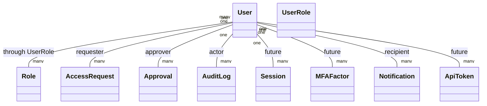
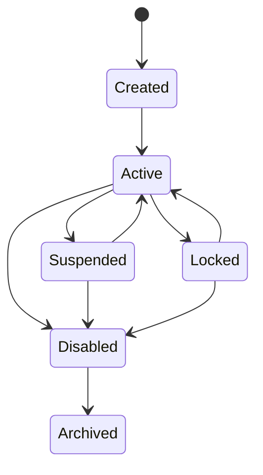

# OpsForge User Domain Specification

**Status:** Frozen design contract

**Scope:** User domain only

**Applies to:** Future implementation in `app/identity/` and user-related references in the wider domain

**Out of scope:** SQLAlchemy models, Python code, migrations, repositories, services, APIs, authentication logic, authorization logic, password hashing, MFA implementation, session handling, and business services

---

## 1. Executive Summary

The User domain defines the local account concept that OpsForge uses to represent a human operator inside the platform. A User is the durable identity anchor for request submission, approval participation, resource stewardship, audit attribution, and role membership. It is not a credential store, not an authentication engine, not an authorization engine, and not a session manager.

OpsForge Version 1 is intentionally local-user-only. The User domain is therefore simple by design: it models a human account, its lifecycle, its identity attributes, and its relationship to other domain concepts. The specification is deliberately strict about boundaries so future support for service accounts, machine identities, and external identity providers can be added later without redesign.

---

## 2. Domain Purpose

### 2.1 Why User exists

User exists to represent a local OpsForge account belonging to a human being who interacts with the platform. It is the local, persistent identity record that other bounded contexts reference when they need to know who requested access, who approved it, who owns a resource, who performed an action, or who has a role membership.

### 2.2 Business problem solved

OpsForge needs a stable domain object that answers questions such as:

- Who submitted this access request?
- Who approved or rejected this workflow step?
- Who owns this protected resource?
- Who performed this audit-worthy action?
- Which local account maps to a specific employee or operator?

The User domain solves those problems without mixing them into access-control, policy, or session logic.

### 2.3 Why PAM systems require User

PAM systems are identity-sensitive systems. Privileged access is only meaningful when requests, approvals, and audit events can be tied back to a specific accountable human. A User provides the accountability anchor that makes JIT access, review workflows, least privilege, and audit traceability possible.

### 2.4 User vs related concepts

| Concept | Meaning | What it is not |
|---|---|---|
| User | A local OpsForge account representing a human operator | Not a credential, not a policy, not a permission set |
| Role | A business authorization category assigned to Users | Not the User itself, not identity proof, not a session |
| Permission | A granular allowed action | Not a User attribute; it is a future authorization primitive |
| Identity | The real-world person or external identity subject the User record represents | Not the local account record itself |
| Authentication | The act of proving identity | Not the User domain; it belongs to the authentication layer |
| Authorization | The act of deciding what a subject may do | Not the User domain; it is derived from policy and roles |
| Session | A transient runtime context after authentication | Not a User record and not part of identity persistence |
| Credential | A secret used to prove identity | Not stored or managed by the User domain |
| Machine Identity | A non-human actor such as a workload or automation principal | Not supported in Version 1 |
| Service Account | A non-human account used by software or automation | Not supported in Version 1 |

### 2.5 DDD boundary statement

User is a core domain entity in the `identity` bounded context. It owns local account identity and lifecycle state. It does not own credential handling, authorization policy, session state, or access-request workflow logic.

---

## 3. Domain Responsibilities and Boundaries

### 3.1 User is responsible for

- Representing a local human account in OpsForge.
- Storing the identity attributes needed for accountability and operational use.
- Maintaining the account lifecycle state.
- Acting as the anchor for request, approval, resource, and audit references.
- Supporting many-role membership through the separate membership association model owned by the roles boundary.
- Serving as the accountable actor for future audit records and workflow actions.

### 3.2 User is not responsible for

- Password storage or hashing.
- MFA secret management.
- Authentication protocol handling.
- Token issuance or validation.
- Session lifecycle management.
- Authorization policy evaluation.
- Permission aggregation.
- Role definition.
- Access-request approval logic.
- Resource access execution.
- Audit-record ownership.
- External directory synchronization logic.

### 3.3 Explicit boundary rules

- A User does not replace a Role.
- A User does not replace a credential.
- A User does not replace a session.
- A User does not evaluate policy.
- A User does not directly store granted privileges.
- A User does not own membership rows; it participates in membership through the separate role boundary.

---

## 4. Identity Strategy

### 4.1 Version 1 supported identities

Version 1 supports **human users only**.

This means the User domain in V1 represents people who interact with OpsForge directly, such as employees, administrators, approvers, auditors, and resource owners.

### 4.2 Future identity forms

The User domain must remain extensible for the following future identity classes without requiring redesign:

- Service Accounts
- Machine Identities
- Azure AD identities
- LDAP identities
- Keycloak identities
- CyberArk identities
- HashiCorp Vault identities

### 4.3 Identity design principle

Future external identity support should be treated as an integration and mapping concern, not a reason to change the local User contract. The local User record remains the OpsForge domain anchor, even if upstream identity sources are introduced later.

### 4.4 V1 identity policy

- No external identity provider is the source of truth in Version 1.
- No separate service-account entity is introduced in Version 1.
- No machine-identity subtype is introduced in Version 1.
- No directory synchronization behavior is required for Version 1.

---

## 5. Domain Model Overview

### 5.1 Core interpretation

The current V1 User domain is intentionally small:

- one User can hold many Roles,
- one User can submit many access requests,
- one User can own many resources,
- one User can appear in many approvals,
- one User can be referenced by many audit records,
- no session state is stored in the User record,
- no credential secret is stored in the User record.

---

## 6. Attributes

The following attributes define the approved business contract for User. Implementation details such as ORM syntax and column declarations are intentionally excluded.

| Attribute | Purpose | Business Meaning | Conceptual Type | Required | Mutable | Uniqueness | Default Behavior | Validation Rules |
|---|---|---|---|---:|---:|---:|---|---|
| id | Stable surrogate identifier | Primary business key used across the platform | UUID v4 | Yes | No | Yes | Generated on create | Must be created once and never reused |
| employee_id | Enterprise identity reference | Stable human-readable enterprise identifier | String | Yes | No | Yes | None | Must be non-blank and unique |
| username | Local login name | Operator-facing account name used for local access and admin lookup | String | Yes | Controlled | Yes | None | Must be non-blank, unique, and operationally stable |
| email | Contact and identity lookup value | Human contact channel and administrative lookup value | Email/string | Yes | Controlled | Yes | None | Must be present, syntactically valid, and unique |
| full_name | Display name | Human-readable name shown in the UI and audit contexts | String | Yes | Yes | No | None | Must be non-blank and readable |
| title | Optional role label or job title | Human context for support and review workflows | String | No | Yes | No | Null | If present, must be bounded and non-blank |
| manager_user_id | Reporting / approval routing reference | Self-reference to another User used for reporting chains and future routing | UUID v4 | No | Yes | No | Null | If supplied, must reference an existing active User and must not point to self |
| status | Account lifecycle state | Operational availability of the account | Enum | Yes | Yes, with restrictions | No | `active` | Must be one of the approved V1 lifecycle values |
| last_login_at | Last successful login time | Operational metadata for administrative review and inactivity analysis | Timestamp with timezone | No | System-managed | No | Null | If present, must be timezone-aware UTC |
| created_at | Creation timestamp | Historical account creation moment | Timestamp with timezone | Yes | No | No | Set automatically | Must be UTC and immutable after insert |
| updated_at | Last modification timestamp | Historical account change moment | Timestamp with timezone | Yes | No | No | Set automatically | Must update automatically on persisted change |

### 6.1 Attribute notes

- `employee_id` is the stable enterprise identity and should not be casually changed.
- `username` is the local login identifier and should be treated as highly stable.
- `email` is both a contact path and a lookup attribute, but it is not the same thing as authentication material.
- `full_name` is the human-facing display value and may change for legal, operational, or correction reasons.
- `title` is optional and informational only.
- `manager_user_id` is a self-reference for reporting chains and future approval routing, not a department model.
- `status` is the primary lifecycle control and should be preferred over deletion.
- `last_login_at` is operational metadata only and must not drive business identity on its own.

### 6.2 Approved V1 values

#### UserStatus

- `active`
- `suspended`
- `locked`
- `disabled`
- `archived`

### 6.3 Attribute design notes

- A User should not have a separate “pending” persisted state in Version 1.
- Account activation is represented by entering the `active` state.
- `suspended` and `locked` both represent blocked access, but they arise from different operational causes.
- `disabled` is a stronger administrative restriction than `suspended` or `locked`.
- `archived` is the terminal historical state.

---

## 7. Relationships

### 7.1 Relationship with Role

**Cardinality:** many-to-many

**Ownership:** the membership association is owned by the roles boundary; the User participates as the member side.

**Lifecycle:**
- A User may have zero, one, or many Roles.
- A Role may be assigned to zero, one, or many Users.
- Role membership is not stored directly on the User record.
- Membership changes must remain auditable and independently governable.

**Design intent:**

User should remain a stable identity anchor while role membership is modeled separately. This keeps the User domain from absorbing authorization semantics.

### 7.2 Relationship with future Access Requests

**Cardinality:** one User may submit many Access Requests

**Ownership:** the Access Request domain owns the request record; User is the requester reference

**Lifecycle:**
- A User may create many requests over time.
- A request may be blocked if the User is not in an allowed lifecycle state.
- Request history must remain even if the User later becomes disabled or archived.

### 7.3 Relationship with future Approval Workflow

**Cardinality:** one User may approve many Requests or Workflows

**Ownership:** the Approval domain owns the decision record; User is the approver reference

**Lifecycle:**
- A User may serve as approver for many decisions.
- A request may require that the approver be a specific snapshot of the requester’s manager.
- Approval eligibility is governed by role and workflow rules, not by the User record itself.

### 7.4 Relationship with future Audit Logs

**Cardinality:** one User may be referenced by many audit records as actor, subject, or related subject

**Ownership:** the Audit Log domain owns historical evidence

**Lifecycle:**
- Audit logs must remain valid even if the referenced User is later archived.
- Audit logs should use the User as an accountability anchor but must not rely on User mutation for historical truth.

### 7.5 Relationship with future Sessions

**Cardinality:** one User may have zero or many sessions over time

**Ownership:** the session subsystem owns session state

**Lifecycle:**
- Sessions are transient and must not be embedded into the User entity.
- Session creation, expiry, revocation, and refresh are operational concerns outside the User aggregate.

### 7.6 Relationship with future MFA

**Cardinality:** one User may have zero or many MFA factors or authenticators

**Ownership:** the MFA subsystem owns factor state and verification data

**Lifecycle:**
- MFA enrollment, challenge, recovery, and revocation are separate concerns.
- User should only provide the identity anchor for MFA, not the secret material.

### 7.7 Relationship with future Notifications

**Cardinality:** one User may receive zero or many notifications

**Ownership:** the notification subsystem owns message state

**Lifecycle:**
- Notifications are operational outputs and should not become part of the User identity record.
- Notifications may reference the User as recipient without changing the User domain model.

### 7.8 Relationship with future API Tokens

**Cardinality:** one User may have zero or many API tokens

**Ownership:** the token subsystem owns token lifecycle and revocation state

**Lifecycle:**
- API tokens must be independently revocable and auditable.
- Tokens are security artifacts and should not be stored on the User entity.

---

## 8. Business Rules

### 8.1 User creation

- A User must have `employee_id`, `username`, `email`, and `full_name` at creation time.
- A User is a human account in Version 1.
- A User should default to `active` unless the provisioning workflow explicitly requires another allowed lifecycle path.
- A User must not be created as a machine identity or service account in Version 1.

### 8.2 Activation

- Activation moves the account into the `active` state.
- An active User may participate in normal platform workflows according to assigned roles and business rules.
- Activation must be authorized and auditable.

### 8.3 Suspension

- Suspension is a temporary restriction used for operational, administrative, or review-based reasons.
- Suspended Users should not participate in privileged workflows until restored.
- Suspension must be reversible when the underlying issue is resolved.

### 8.4 Locking

- Locking is a security-driven restriction state, typically used for risky conditions such as repeated failed access attempts or security intervention.
- A locked User is treated as unavailable for operational use until explicitly released by an authorized action.
- Locking should be auditable and distinguishable from ordinary suspension.

### 8.5 Deactivation / disabling

- Disabling is a stronger administrative state than suspension or locking.
- A disabled User must not submit requests, approve workflows, or otherwise act as an active operator.
- In Version 1, disabled is effectively terminal for ordinary operations and should move toward archival rather than casual reuse.

### 8.6 Reactivation

- Reactivation is allowed from `suspended` or `locked` back to `active`.
- Reactivation from `disabled` is not an ordinary Version 1 path.
- Archived accounts are terminal historical records and should not be reactivated in place.

### 8.7 Archiving

- Archiving preserves the record for history, audit, and referential integrity.
- Archived Users remain part of historical records but should not be used for new operational actions.

### 8.8 Deletion

- Hard delete is restricted in practice.
- Historical requests, approvals, resources, and audit records may depend on the User reference.
- Archival is preferred over deletion for the normal lifecycle.

### 8.9 Role assignment and removal

- A User may hold multiple roles.
- Role assignment and removal are handled through the separate role membership model owned by the roles boundary.
- A User must not directly store role membership as a denormalized list.
- Inactive, locked, disabled, or archived lifecycle states must be considered when evaluating whether role assignment should be allowed.

### 8.10 Display name updates

- `full_name` may be updated when the human identity changes or when data correction is necessary.
- `title` may be updated as the human’s job context changes.
- Display-oriented updates should be auditable.

### 8.11 Username rules

- `username` must be unique across the platform.
- It must be stable enough to support local login and administrative lookup.
- Username changes, if allowed by governance, should be controlled because they affect user experience, support, and audit readability.

### 8.12 Email rules

- `email` must be syntactically valid.
- `email` must be unique.
- `email` is a contact and lookup attribute, not a credential.
- A change to `email` should be treated as a meaningful identity maintenance event.

### 8.13 Reserved accounts, system accounts, and administrative accounts

- Reserved operational accounts should be minimized and governed carefully.
- Administrative accounts are ordinary User records with privileged Role assignments, not a separate entity type.
- System accounts are not part of Version 1 and should instead be introduced later as service accounts or machine identities if the product requires them.
- Special handling should come from lifecycle state and role membership, not from hidden subtypes in the User record.

---

## 9. Validation Strategy

### 9.1 Database constraints

Database constraints should enforce:

- unique `employee_id`
- unique `username`
- unique `email`
- required fields for `employee_id`, `username`, `email`, and `full_name`
- nullable `manager_user_id`
- `manager_user_id` cannot equal `id`
- valid foreign-key reference for `manager_user_id`
- `manager_user_id`, when supplied, must reference an existing active user
- deterministic constraint naming for Alembic

### 9.2 Application validation

Application validation should enforce:

- valid email syntax
- non-blank display fields
- allowed status values
- controlled transitions between lifecycle states
- business-meaningful username and name inputs
- stability rules for identity fields

### 9.3 Business validation

Business validation should enforce:

- suspended, locked, disabled, or archived Users cannot perform actions that require an active account
- role assignment must respect the User’s lifecycle state
- archived Users remain historical only
- self-manager relationships are forbidden
- manager references must point to existing active Users
- creation, reactivation, suspension, and disablement must be auditable

### 9.4 Authorization validation

Authorization validation should enforce:

- only authorized administrators may create, update, suspend, lock, disable, or archive Users
- only authorized administrators may adjust manager relationships
- only authorized administrators may alter role memberships
- the User domain must not itself determine authorization; it only supplies the state that authorization consumes

---

## 10. Security

### 10.1 Least privilege

The User domain must support least privilege by allowing accounts to be disabled, suspended, or locked independently of role definitions. Roles determine what a User may do; User determines who the actor is.

### 10.2 Account misuse

- Stale accounts are a security risk and should be reviewed regularly.
- Privileged users should not be kept active indefinitely without business justification.
- Role membership should be reviewed independently from User existence.

### 10.3 Privilege escalation

- The User domain must not be used to hide privilege by overloading fields such as title or department.
- Elevated access must come from role membership and workflow, not from the User record itself.
- User state transitions should be restricted to prevent unauthorized restoration of blocked accounts.

### 10.4 Dormant accounts

- Dormant accounts should be visible through `status` and `last_login_at`.
- Inactivity analysis should be possible without embedding policy into the User entity.
- Dormant accounts should be candidates for administrative review or disablement.

### 10.5 Locked accounts

- Locked accounts are a security response state and should be treated distinctly from suspended or disabled accounts.
- A locked account must not be considered safe for operational use until an authorized recovery action occurs.

### 10.6 Identity lifecycle

- Identity changes must be auditable.
- High-sensitivity fields such as `username`, `email`, `manager_user_id`, and `status` should not change without administrative traceability.
- The User record should preserve historical accountability rather than being replaced casually.

### 10.7 Audit expectations

The following events should eventually be auditable:

- user created
- user updated
- user activated
- user suspended
- user locked
- user disabled
- user archived
- manager changed
- role assigned
- role removed

### 10.8 Sensitive information

- The User record should not store passwords, MFA secrets, session tokens, or API secrets.
- Personal data should be limited to the minimum needed for business operation.
- Sensitive operational details should remain in their own bounded contexts.

---

## 11. Lifecycle

### 11.1 Lifecycle states

The approved V1 lifecycle is:

- Created
- Active
- Suspended
- Locked
- Disabled
- Archived

### 11.2 State transition model

### 11.3 Lifecycle notes

- `Created` is a provisioning phase, not a separate long-lived operational identity state.
- `Active` is the normal working state.
- `Suspended` is a reversible administrative restriction.
- `Locked` is a security restriction that usually requires explicit recovery.
- `Disabled` is a stronger operational restriction and is typically not reactivated in place in Version 1.
- `Archived` is terminal historical retention.

---

## 12. Performance

### 12.1 Lookup strategy

User lookups are expected to be frequent and should support fast access by:

- email
- username
- employee_id
- status
- manager_user_id
- last_login_at for operational review

### 12.2 Index strategy

High-value indexes should support the following common access patterns:

- `users.email` for login and identity lookup
- `users.username` for administrative and local login lookup
- `users.employee_id` for enterprise support and reference
- `users.status` for operational queues and lifecycle filtering
- `users.manager_user_id` for reporting and approval routing
- `users.last_login_at` for inactivity review and operational analysis

### 12.3 Role lookup

User-driven role lookup should be performed through the separate membership association and role domain. The User domain does not own role metadata, but it must remain efficient for membership-based reads.

### 12.4 Future scalability

The User domain should scale well because:

- identity fields are compact,
- lookups are key-based,
- lifecycle control is status-driven,
- role membership is normalized outside the User record,
- future identity-provider mapping can be layered on without redesign.

---

## 13. Future Compatibility

The User domain must remain compatible with the following future capabilities without redesigning the core record:

- RBAC
- ABAC
- JIT Access
- Approval Workflow
- Audit Logs
- Azure AD
- LDAP
- Keycloak
- CyberArk
- HashiCorp Vault
- Multi-Tenant Support
- Machine Identities
- Service Accounts

### 13.1 Extension points

Future compatibility should be achieved by adding separate bounded concepts rather than overloading the User entity. Examples include:

- service-account entities,
- machine-identity entities,
- MFA factor records,
- API token records,
- session records,
- external identity mapping records,
- tenant-scoping records if multi-tenancy is later introduced.

### 13.2 Compatibility principle

The User contract must remain valid even if future identity sources are introduced. The local User record should remain the OpsForge accountability anchor, with integration-specific concerns handled elsewhere.

---

## 14. Risks and Mitigations

### 14.1 Security risks

**Risk:** Dormant or forgotten accounts can become privileged entry points.

**Mitigation:** Use status, `last_login_at`, role review, and audit events to identify stale access.

### 14.2 Identity risks

**Risk:** Human identity data may change over time while history remains sensitive.

**Mitigation:** Keep stable enterprise identifiers, audit sensitive changes, and preserve historical references.

### 14.3 Scalability risks

**Risk:** Future service accounts or machine identities could pressure the V1 user model.

**Mitigation:** Keep V1 human-only and add future identity types as separate bounded concepts.

### 14.4 Maintenance risks

**Risk:** Username or email changes may create support and audit confusion.

**Mitigation:** Treat both fields as controlled and auditable identity-maintenance attributes.

### 14.5 Future integration risks

**Risk:** External identity providers may not map cleanly to local human accounts.

**Mitigation:** Use adapter-style integration and keep local User semantics provider-neutral.

---

## 15. Testing Strategy

### 15.1 Unit tests

Future unit tests should cover:

- user creation rules
- allowed and disallowed lifecycle transitions
- username and email validation
- manager self-reference prevention
- role assignment governance behavior

### 15.2 Integration tests

Future integration tests should cover:

- persistence of unique identity fields
- manager self-reference behavior
- lifecycle state persistence
- indexing-sensitive lookup behavior
- interaction with roles, requests, approvals, and audit references

### 15.3 Validation tests

Future validation tests should cover:

- email syntax and uniqueness
- employee identifier uniqueness
- blocked state transitions
- nullability and required-field enforcement
- reserved-account governance expectations

### 15.4 Relationship tests

Future relationship tests should cover:

- one-to-many user ownership semantics
- many-to-many role membership through the association model
- future references from requests, approvals, and audit logs
- self-referential manager behavior

### 15.5 Security tests

Future security tests should cover:

- locked and suspended account behavior
- disabled account access denial
- archive-only historical retention
- privileged account misuse scenarios
- stale-account review support

---

## 16. Architecture Review

### 16.1 Assumption check

The key assumption in this design is that Version 1 should support only human users. That assumption is correct for a first release because it keeps the identity model small, understandable, and aligned with the frozen domain design.

### 16.2 Simplification review

The User domain should remain as simple as possible:

- one stable local account entity,
- one self-reference for manager routing,
- one status-driven lifecycle,
- one normalized role membership path,
- no credential or session storage.

This is the right amount of design for V1.

### 16.3 Recommended simplifications

- Do not add service-account semantics to User in V1.
- Do not add machine-identity semantics to User in V1.
- Do not add credential fields to User in V1.
- Do not embed authorization fields beyond lifecycle and identity metadata.
- Keep historical accountability in audit logs, not in extra User subtypes.

### 16.4 Final architectural stance

The User domain is appropriately narrow and production-oriented. It creates a strong identity anchor without absorbing concerns that belong to authentication, authorization, sessions, or external identity federation.

---

## 17. Final Assessment

### Executive Summary

The User domain is well-scoped for OpsForge Version 1. It supports local human accounts, preserves clear bounded-context separation, and remains extensible for later service accounts, machine identities, and external directory mappings. The design avoids unnecessary complexity while covering the identity, lifecycle, and accountability needs of a production PAM system.

### Scores

- **Architecture Score:** 96/100
- **Security Score:** 95/100
- **Maintainability Score:** 97/100
- **Extensibility Score:** 95/100
- **Production Readiness Score:** 95/100

### Strengths

- Clear separation between User, Role, Credential, Session, Authentication, Authorization, and Policy.
- Human-user-only V1 scope keeps the model small and understandable.
- Strong compatibility with JIT access, approval routing, and auditability.
- Extensible path for future identity-provider integration without redesign.
- Status-driven lifecycle aligns with the frozen database design.

### Weaknesses

- V1 does not support non-human identities, which is intentional but means future expansion will require new domain concepts.
- Username and email governance must be enforced carefully because they are operationally sensitive fields.
- The self-referential manager link introduces lifecycle considerations that must be handled consistently in implementation.

### Recommendation

APPROVED FOR IMPLEMENTATION
